# AI Agent System Documentation

## Overview

This document provides comprehensive documentation of the AI Agent System in the Gmail Agent project. The system implements two distinct agent architectures working together to provide intelligent email management, research, and analysis capabilities.

## Architecture Overview

```mermaid
flowchart TB
    subgraph User["👤 User Interface"]
        UI[Chat Interface / API Calls]
    end
    
    subgraph API["🔌 API Layer"]
        ENDPOINTS["/chat<br/>/email-analysis<br/>/analyze-and-reply"]
    end
    
    subgraph Agents["🤖 Agent Architectures"]
        direction TB
        
        subgraph Single["Single Agent (ReAct Pattern)"]
            CHATBOT[Main Chatbot Agent<br/>LangGraph ReAct]
        end
        
        subgraph Multi["Multi-Agent Pipeline"]
            ORCH[MultiAgentEmailAnalyzer<br/>Orchestrator]
            A1[EmailAnalysisAgent]
            A2[ResearchPlanningAgent]
            A3[WebResearchAgent]
            A4[ReportGenerationAgent]
        end
    end
    
    subgraph Tools["🛠️ Tool Ecosystem"]
        SEARCH[Search Tools<br/>Google Grounding<br/>Tavily]
        EMAIL[Email Tools<br/>Gmail via Composio]
        PDF[PDF Generator<br/>+ AI Quote Images]
    end
    
    subgraph LLM["🧠 LLM Providers"]
        GROQ[Groq<br/>Llama 3.x]
        GEMINI[Google Gemini<br/>2.0/2.5 Flash/Pro]
    end
    
    UI --> ENDPOINTS
    ENDPOINTS --> CHATBOT
    ENDPOINTS --> ORCH
    
    CHATBOT --> SEARCH
    CHATBOT --> EMAIL
    CHATBOT --> PDF
    CHATBOT --> GROQ
    CHATBOT --> GEMINI
    
    ORCH --> A1
    A1 --> A2
    A2 --> A3
    A3 --> A4
    A4 --> PDF
    
    A3 --> SEARCH
    A3 --> GEMINI
    
    style Single fill:#e1f5ff
    style Multi fill:#fff4e1
    style Tools fill:#e1ffe1
    style LLM fill:#ffe1f0
```



---

## Table of Contents

1. [Agent Architecture 1: Single ReAct Agent](#agent-architecture-1-single-react-agent)
2. [Agent Architecture 2: Multi-Agent Pipeline](#agent-architecture-2-multi-agent-pipeline)
3. [Agent Interactions & Workflows](#agent-interactions--workflows)
4. [Configuration & Environment](#configuration--environment)
5. [Tool Ecosystem](#tool-ecosystem)
6. [API Integration](#api-integration)
7. [Decision Logic](#decision-logic)
8. [Troubleshooting](#troubleshooting)

---

## Agent Architecture 1: Single ReAct Agent

### Main Chatbot Agent

**Type:** Autonomous ReAct Agent (Reasoning + Acting)  
**Pattern:** LangGraph `create_react_agent`  
**File:** `gmail-agent/server/chatbot.py`

#### Purpose
General-purpose research and email assistant that can autonomously decide:
- When to use tools vs. answer from training data
- Which tools to use for specific tasks
- How to format responses (chat, PDF, email)

#### Architecture


#### Key Methods

| Method | Purpose | Parameters | Returns |
|--------|---------|------------|---------|
| `chat()` | Main blocking chat | `user_message, groq_api_key, user_id, conversation_history` | `dict` with response |
| `chat_stream()` | Streaming chat | Same as `chat()` | `AsyncGenerator` |
| `get_agent_tools()` | Tool factory | `user_id` | List of tools |
| `create_grounding_tools()` | Search tool | - | Grounded search function |
| `run_agent_with_fallback()` | Execution with fallback | `agent_factory, inputs, groq_api_key` | State dict |

#### System Prompt Capabilities

The agent is guided by a comprehensive SYSTEM_PROMPT (Lines 653-1090) defining:

1. **Political Quotes & Social Media Research**
   - Find and extract politician quotes
   - Search Twitter/X, Facebook, Instagram, TikTok
   - Categorize: official statements, campaign promises, policy positions
   - Always cite: date, platform, context, link

2. **AI-Generated Quote Visualizations**
   - Auto-generate images for political quotes in PDFs
   - Up to 5 images per PDF
   - Uses Gemini image generation
   - Professional design with national colors

3. **Intelligent Search Decision** ⭐
   - **Use web search for:** Current events (2024-2026), breaking news, real-time data, fact-checking
   - **Use training data for:** History (pre-2024), general knowledge, definitions, creative tasks

4. **PDF Generation Decision Matrix**
   - Generate PDF when: "buat PDF", comprehensive research, political analysis
   - Auto-send email when: "kirim ke email", "reply", "laporkan" (no PDF mentioned)

5. **Email Formatting Rules** (Zero Tolerance)
   - Use "•" bullets (never asterisks)
   - **Bold** for keywords
   - ━━━ dividers (40+ chars)
   - UPPERCASE headers
   - Numbered sources [1], [2], [3]

#### Tools Available

| Tool | Function | Provider | When Used |
|------|----------|----------|-----------|
| `search_google` | Real-time web search with citations | Google Grounding | Research queries |
| `visit_webpage` | Extract webpage content | httpx + BS4 | Deep dive into sources |
| `download_file` | Download files from URLs | httpx | File attachments |
| `tavily_search` | Advanced web search | Tavily API | Alternative search |
| `tavily_extract` | Extract content from URLs | Tavily API | Content extraction |
| `tavily_crawl` | Crawl websites | Tavily API | Multi-page sites |
| `tavily_map` | Discover site structure | Tavily API | Sitemap generation |
| `gmail_send_email` | Send emails | Composio | Email sending |
| `gmail_create_draft` | Create drafts | Composio | Draft creation |
| `gmail_fetch_emails` | Fetch emails | Composio | Email retrieval |
| `generate_pdf_report_wrapped` | Generate PDFs | FPDF2 | Report generation |

#### Dependencies

```python
# Core Framework
from langgraph.prebuilt import create_react_agent
from langchain_core.tools import tool

# LLM Providers
from langchain_groq import ChatGroq
from langchain_google_genai import ChatGoogleGenerativeAI

# External Services
from google import genai  # Google Grounding
from composio import Composio  # Gmail
from tavily import TavilyClient  # Search

# PDF Generation
from fpdf import FPDF
from fpdf.html import HTMLMixin
```

---

## Agent Architecture 2: Multi-Agent Pipeline

### Overview

**Pattern:** Sequential Multi-Agent Pipeline  
**Orchestrator:** `MultiAgentEmailAnalyzer`  
**File:** `gmail-agent/server/email_analysis_agents.py`

A coordinator agent that orchestrates 4 specialized sub-agents for comprehensive email fact-checking.

```mermaid
flowchart LR
    subgraph Input["📧 Input"]
        EMAIL[Email Content]
        QUERY[User Query]
    end
    
    subgraph Pipeline["🔍 Multi-Agent Pipeline"]
        direction LR
        
        A1["📋 Stage 1<br/>EmailAnalysisAgent<br/>Extract Claims"]
        A2["📊 Stage 2<br/>ResearchPlanningAgent<br/>Create Strategy"]
        A3["🌐 Stage 3<br/>WebResearchAgent<br/>Execute Research"]
        A4["📝 Stage 4<br/>ReportGenerationAgent<br/>Compile Report"]
    end
    
    subgraph Output["📄 Output"]
        MARKDOWN[Markdown Report]
        PDF[PDF with Images]
    end
    
    EMAIL --> A1
    QUERY --> A1
    
    A1 -->|Claims & Entities| A2
    A2 -->|Research Plan| A3
    A3 -->|Research Results| A4
    A4 -->|Markdown| MARKDOWN
    MARKDOWN -->|Optional| PDF
    
    style A1 fill:#e1f5ff
    style A2 fill:#fff4e1
    style A3 fill:#e1ffe1
    style A4 fill:#ffe1f0
```



---

### Agent 1: EmailAnalysisAgent

**File:** `email_analysis_agents.py` (Lines 14-97)  
**Purpose:** Extracts factual claims from emails that need verification

#### Initialization

```python
class EmailAnalysisAgent:
    def __init__(self, google_api_key: str):
        self.llm = ChatGoogleGenerativeAI(
            model="gemini-2.0-flash",
            temperature=0.2,  # Low temp for extraction
            google_api_key=google_api_key
        )
```

#### Key Method

```python
async def analyze_email(
    self, 
    email_content: str, 
    user_query: str = ""
) -> Dict[str, Any]:
    """
    Analyzes email content to extract factual claims.
    
    Args:
        email_content: Full email including subject, sender, body
        user_query: Specific analysis instructions
    
    Returns:
        {
            "summary": "Email summary",
            "claims": ["claim1", "claim2"],  # Facts to verify
            "entities": ["people", "orgs", "locations"],
            "priorities": ["high", "medium", "low"],
            "suggested_search_terms": ["term1", "term2"]
        }
    """
```

#### System Prompt Focus

- **Political statements**, promises, achievements
- **Business claims**, financial performance
- **Scientific/medical assertions**
- **Historical events** or statistics
- **Personal achievements** or qualifications

#### Output Schema

```json
{
  "summary": "Comprehensive email summary",
  "claims": [
    "Factual claim needing verification 1",
    "Factual claim needing verification 2"
  ],
  "entities": {
    "people": ["Person Name"],
    "organizations": ["Org Name"],
    "locations": ["Location"],
    "dates": ["2024-01-15"]
  },
  "priorities": [
    {"claim": "claim1", "priority": "high"},
    {"claim": "claim2", "priority": "medium"}
  ],
  "suggested_search_terms": [
    ["search terms for claim1"],
    ["search terms for claim2"]
  ]
}
```

---

### Agent 2: ResearchPlanningAgent

**File:** `email_analysis_agents.py` (Lines 100-175)  
**Purpose:** Creates research strategies based on email analysis

#### Initialization

```python
class ResearchPlanningAgent:
    def __init__(self, google_api_key: str):
        self.llm = ChatGoogleGenerativeAI(
            model="gemini-2.0-flash",
            temperature=0.1,  # Very low temp for planning
            google_api_key=google_api_key
        )
```

#### Key Method

```python
async def create_research_plan(
    self,
    email_analysis: Dict[str, Any]
) -> Dict[str, Any]:
    """
    Creates research strategy for verifying claims.
    
    Args:
        email_analysis: Output from EmailAnalysisAgent
    
    Returns:
        {
            "strategy": "Overall research approach",
            "search_queries": ["query1", "query2", "query3"],
            "priority_order": ["claim1", "claim2"],
            "source_types": ["news", "gov", "academic"],
            "expected_confidence": {"claim1": "high"}
        }
    """
```

#### Source Priority System

The agent prioritizes sources in this order:

1. **Major news organizations** (Reuters, AP, BBC)
2. **Government websites** and official reports
3. **Academic papers** and research institutions
4. **Company press releases** and financial reports
5. **Fact-checking organizations** (Snopes, FactCheck.org)
6. **Social media** and official statements

#### Output Schema

```json
{
  "strategy": "Comprehensive verification strategy description",
  "search_queries": [
    "Specific query for claim 1",
    "Specific query for claim 2",
    "Specific query for claim 3"
  ],
  "priority_order": ["high_priority_claim", "medium_priority_claim"],
  "source_types": ["official", "news", "academic"],
  "expected_confidence": {
    "claim1": "high",
    "claim2": "medium"
  },
  "timeline": "Recommended research timeline"
}
```

---

### Agent 3: WebResearchAgent ⭐

**File:** `email_analysis_agents.py` (Lines 178-352)  
**Purpose:** Executes web research using Google Grounding with Search

#### Initialization

```python
class WebResearchAgent:
    def __init__(self, google_api_key: str):
        self.llm = ChatGoogleGenerativeAI(
            model="gemini-2.0-flash",
            temperature=0.1,
            google_api_key=google_api_key
        )
        self.google_api_key = google_api_key
        
        # Google GenAI for grounding
        from google import genai
        from google.genai import types
        self.genai = genai
        self.types = types
        self.grounding_available = True
```

#### Key Method

```python
async def conduct_research(
    self,
    research_plan: Dict[str, Any]
) -> Dict[str, Any]:
    """
    Executes research plan using Google Grounding.
    
    Args:
        research_plan: Output from ResearchPlanningAgent
    
    Returns:
        {
            "raw_results": {...},
            "analysis": {
                "key_findings": [...],
                "credibility_assessment": "...",
                "conflicting_info": [...],
                "source_quality": "...",
                "confidence_levels": {...}
            }
        }
    """
```

#### Google Grounding Implementation

```python
async def search_with_grounding(idx, query):
    # Initialize Gemini client
    client = self.genai.Client(api_key=self.google_api_key)
    
    # Create grounding tool
    grounding_tool = self.types.Tool(
        google_search=self.types.GoogleSearch()
    )
    
    # Configure generation
    config = self.types.GenerateContentConfig(
        tools=[grounding_tool]
    )
    
    # Generate with grounding
    response = client.models.generate_content(
        model="gemini-2.0-flash",
        contents=f"Research: {query}",
        config=config,
    )
    
    # Extract sources from metadata
    sources = []
    if response.candidates[0].grounding_metadata:
        metadata = response.candidates[0].grounding_metadata
        chunks = metadata.grounding_chunks
        
        for chunk in chunks:
            if chunk.web:
                sources.append({
                    "title": chunk.web.title,
                    "link": chunk.web.uri,
                    "index": idx
                })
    
    return {
        "query": query,
        "content": response.text,
        "sources": sources
    }
```

#### Parallel Execution

```python
# Run up to 3 queries in parallel
import asyncio

queries = research_plan["search_queries"][:3]  # Limit to 3
tasks = [search_with_grounding(i+1, q) for i, q in enumerate(queries)]
results = await asyncio.gather(*tasks)
```

#### Source Extraction

```python
# Extract structured citation data
if response.candidates[0].grounding_metadata:
    metadata = response.candidates[0].grounding_metadata
    
    # Web search queries used
    web_search_queries = metadata.web_search_queries
    
    # Source chunks with titles and URIs
    grounding_chunks = metadata.grounding_chunks
    
    # Text segments with citations
    grounding_supports = metadata.grounding_supports
```

#### Dependencies

```python
from google import genai
from google.genai import types
import asyncio  # For parallel execution
```

---

### Agent 4: ReportGenerationAgent

**File:** `email_analysis_agents.py` (Lines 355-442)  
**Purpose:** Generates comprehensive fact-checking reports

#### Initialization

```python
class ReportGenerationAgent:
    def __init__(self, google_api_key: str):
        self.llm = ChatGoogleGenerativeAI(
            model="gemini-2.0-flash",
            temperature=0.3,  # Slightly higher for creativity
            google_api_key=google_api_key
        )
```

#### Key Method

```python
async def generate_report(
    self,
    email_content: str,
    email_analysis: Dict[str, Any],
    research_plan: Dict[str, Any],
    research_results: Dict[str, Any]
) -> str:
    """
    Generates comprehensive fact-checking report.
    
    Args:
        email_content: Original email
        email_analysis: Claims extracted
        research_plan: Research strategy
        research_results: Findings from web research
    
    Returns:
        Markdown-formatted report string
    """
```

#### Report Structure

```markdown
# Fact-Checking Report: [Email Subject]

## Executive Summary
- Brief overview of findings
- Overall credibility assessment

## Original Claims
1. **Claim 1**: [Original claim from email]
2. **Claim 2**: [Original claim from email]

## Investigation Methodology
- Search queries used
- Sources consulted
- Verification approach

## Detailed Findings

### Claim 1: [Description]
**Status**: [Verified/Partially Verified/Unverified/False]

**Evidence**:
- Source 1: [Citation with link]
- Source 2: [Citation with link]

**Analysis**:
[Detailed analysis of the claim]

### Claim 2: [Description]
...

## Conclusion
- Summary of verified facts
- Confidence levels
- Recommendations

## Sources
[1] Source Title - URL
[2] Source Title - URL
```

---

### Orchestrator: MultiAgentEmailAnalyzer

**File:** `email_analysis_agents.py` (Lines 444-532)  
**Purpose:** Coordinates the entire 4-agent pipeline

#### Initialization

```python
class MultiAgentEmailAnalyzer:
    def __init__(self):
        google_api_key = os.environ.get("GOOGLE_API_KEY")
        
        # Initialize all 4 sub-agents
        self.email_agent = EmailAnalysisAgent(google_api_key)
        self.planning_agent = ResearchPlanningAgent(google_api_key)
        self.research_agent = WebResearchAgent(google_api_key)
        self.report_agent = ReportGenerationAgent(google_api_key)
```

#### Key Method

```python
async def analyze_and_report(
    self,
    email_content: str,
    user_query: str = "",
    generate_pdf: bool = False
) -> Dict[str, Any]:
    """
    Orchestrates complete email analysis pipeline.
    
    Args:
        email_content: Email to analyze
        user_query: Specific analysis instructions
        generate_pdf: Whether to generate PDF report
    
    Returns:
        {
            "success": True/False,
            "stages_completed": [...],
            "report": "Markdown report",
            "pdf_path": "/path/to/pdf" (if generated),
            "errors": [...]
        }
    """
```

#### Pipeline Execution Flow


#### Error Handling

Each stage includes try-catch with detailed error tracking:

```python
results = {
    "success": True,
    "stages_completed": [],
    "errors": []
}

try:
    # Stage 1
    email_analysis = await self.email_agent.analyze_email(...)
    results["stages_completed"].append("email_analysis")
except Exception as e:
    results["errors"].append(f"Email analysis failed: {str(e)}")
    results["success"] = False
```

---

## Agent Interactions & Workflows

### 1. Chat Workflow (Single Agent)


### 2. Email Analysis Workflow (Multi-Agent)


---

## Configuration & Environment

### Required Environment Variables

```bash
# REQUIRED - For all agents
GOOGLE_API_KEY=your-google-api-key  # Gemini + Grounding

# REQUIRED - For chatbot agent
GROQ_API_KEY=your-groq-api-key  # Primary LLM

# REQUIRED - For Gmail tools
COMPOSIO_API_KEY=your-composio-api-key

# OPTIONAL - For Tavily search
TAVILY_API_KEY=your-tavily-api-key
```

### Model Configuration

| Agent | Primary Model | Fallback | Temperature |
|-------|--------------|----------|-------------|
| Chatbot Agent | Groq Llama 3.x | Gemini 2.0-flash | 0 |
| EmailAnalysisAgent | Gemini 2.0-flash | - | 0.2 |
| ResearchPlanningAgent | Gemini 2.0-flash | - | 0.1 |
| WebResearchAgent | Gemini 2.0-flash | - | 0.1 |
| ReportGenerationAgent | Gemini 2.0-flash | - | 0.3 |

### Python Dependencies

```txt
# Core Framework
langgraph>=0.1.0
langchain-core>=0.3.0
langchain-groq>=0.2.0
langchain-google-genai>=2.0.0

# Google Grounding
google-genai>=1.0.0

# External Services
composio>=0.11.0
tavily-python>=0.5.0

# PDF Generation
fpdf2>=2.8.0
markdown>=3.7
Pillow>=11.0.0

# Web Tools
httpx>=0.28.0
beautifulsoup4>=4.12.0
fake-useragent>=2.0.0
pypdf>=5.0.0
python-docx>=1.1.0
```

---

## Tool Ecosystem

### Search Tools

```mermaid
flowchart LR
    subgraph Search["🔍 Search Tools"]
        G[Google Grounding<br/>Primary]
        T[Tavily<br/>Alternative]
    end
    
    subgraph Features["Features"]
        R[Real-time]
        C[Citations]
        P[Parallel]
    end
    
    G --> R
    G --> C
    T --> P
    
    style G fill:#e1f5ff
    style T fill:#fff4e1
```



**Google Grounding:**
- Real-time web search
- Automatic citations
- Source quality prioritization
- Multi-language support

**Tavily:**
- Advanced search parameters
- Content extraction
- Website crawling
- Sitemap discovery

### Email Tools (via Composio)

| Tool | Function | Parameters |
|------|----------|------------|
| `gmail_send_email` | Send email | recipient, subject, body, attachment |
| `gmail_create_draft` | Create draft | recipient, subject, body, attachment |
| `gmail_fetch_emails` | Fetch emails | limit, query |

### PDF Generator

**Features:**
- Markdown to PDF conversion
- Professional styling with colors
- AI-generated quote images (up to 5)
- Table support
- Info/warning boxes
- Automatic citations

**Quote Image Generation:**
```python
generate_quote_image(
    quote_text="...",
    author="Prabowo",
    context="Defense policy",
    api_key=GOOGLE_API_KEY
)
# Returns: Path to generated PNG image
```

---

## API Integration

**File:** `gmail-agent/server/api.py`

### Available Endpoints

| Endpoint | Method | Agent Used | Description |
|----------|--------|------------|-------------|
| `/chat` | POST | Chatbot Agent | Main chat interface |
| `/chat/stream` | POST | Chatbot Agent | Streaming chat |
| `/email-analysis` | POST | MultiAgentEmailAnalyzer | Analyze email |
| `/analyze-and-reply` | POST | MultiAgentEmailAnalyzer | Analyze + auto-reply |
| `/fetch-email-for-analysis` | POST | MultiAgentEmailAnalyzer | Fetch specific email |

### Request/Response Examples

#### Chat Endpoint

**Request:**
```json
{
  "message": "Cari isu Prabowo dan kirim ke email saya",
  "user_id": "user-123",
  "conversation_history": [],
  "auto_execute": true
}
```

**Response:**
```json
{
  "type": "action_result",
  "action": "gmail_send_email",
  "message": "✅ Email berhasil dikirim!"
}
```

#### Email Analysis Endpoint

**Request:**
```json
{
  "email_content": "Subject: Important Update\n\nClaim: Indonesia's GDP grew 5%...",
  "user_query": "Verify the economic claims",
  "generate_pdf": true
}
```

**Response:**
```json
{
  "success": true,
  "stages_completed": [
    "email_analysis",
    "research_planning",
    "web_research",
    "report_generation",
    "pdf_generation"
  ],
  "report": "# Fact-Checking Report...",
  "pdf_path": "/path/to/report.pdf"
}
```

---

## Decision Logic

### 1. When to Use Web Search vs Training Data


### 2. PDF Generation Decision Matrix

| User Request | PDF? | Auto-Send? | Format |
|-------------|------|------------|---------|
| "buat PDF" | ✅ Yes | If specified | PDF Attachment |
| "kirim ke email" (no PDF mention) | ❌ No | ✅ Yes | Formatted Text |
| "reply email ini" | ❌ No | ✅ Yes | Formatted Text |
| "analisis dan kirim" | ❌ No | ✅ Yes | Formatted Text |
| "generate report with PDF" | ✅ Yes | If specified | PDF Attachment |

### 3. Tool Selection Logic

```python
if "cari" in query or "search" in query:
    if is_recent_topic(query):
        tool = search_google  # Google Grounding
    else:
        tool = tavily_search  # Tavily

if "kirim email" in query:
    tool = gmail_send_email

if "buat PDF" in query:
    tool = generate_pdf_report_wrapped
```

---

## Troubleshooting

### Common Issues

#### 1. "GOOGLE_API_KEY not found"
**Solution:**
```bash
export GOOGLE_API_KEY="your-key"
# Or add to .env file
```

#### 2. Agent not using web search when expected
**Check:**
- Query contains time-sensitive keywords?
- Model temperature not too high?
- Grounding tool properly initialized?

#### 3. PDF generation slow
**Optimization:**
- Reduce max_quote_images (default: 5)
- Disable quote images: `enable_quote_images=False`
- Cache frequent searches

#### 4. Multi-agent pipeline fails mid-way
**Check:**
- All 4 sub-agents initialized correctly?
- GOOGLE_API_KEY valid for all agents?
- Error logs in `results["errors"]`

#### 5. Email formatting not following rules
**Verify:**
- SYSTEM_PROMPT updated with formatting rules?
- Zero-tolerance rule being enforced?
- Agent has proper examples in prompt?

---

## Performance Metrics

### Response Times (Typical)

| Operation | Time | Notes |
|-----------|------|-------|
| Simple chat response | 1-3s | No tools needed |
| Web search query | 3-8s | Google Grounding |
| Email analysis (full pipeline) | 15-30s | 4 agents + research |
| PDF generation (no images) | 2-5s | Depends on content |
| PDF with AI images | 20-45s | 5 images max |

### Cost Optimization

1. **Use intelligent search decision** - Don't search for general knowledge
2. **Cache repeated queries** - Use `@lru_cache`
3. **Limit parallel searches** - Max 3 queries per research
4. **Disable quote images when not needed** - Save image generation costs

---

## Best Practices

### 1. Agent Selection

- **Chatbot Agent**: For general queries, email operations, quick research
- **Multi-Agent Pipeline**: For deep fact-checking, comprehensive analysis, formal reports

### 2. Error Handling

```python
try:
    result = await agent.execute()
except Exception as e:
    logger.error(f"Agent failed: {e}")
    return {"success": False, "error": str(e)}
```

### 3. Monitoring

```python
# Track agent performance
metrics = {
    "agent_type": "WebResearchAgent",
    "queries_executed": 3,
    "response_time": 8.5,
    "sources_found": 12,
    "success": True
}
```

---

## Changelog

### v1.0.0 - Initial Multi-Agent System
- Implemented 4-agent pipeline for email analysis
- Google Grounding integration for web research
- PDF generation with professional formatting

### v1.1.0 - Enhanced Features
- AI-generated quote images for PDFs
- Political quotes research capabilities
- Auto-send email functionality
- Intelligent search decision logic

### v1.2.0 - Smart Intelligence
- Added search vs training data decision logic
- Cost optimization through intelligent queries
- Improved response formatting rules
- English documentation

---

## References

- [LangGraph Documentation](https://langchain-ai.github.io/langgraph/)
- [Google Grounding Guide](https://ai.google.dev/gemini-api/docs/grounding)
- [Composio Documentation](https://docs.composio.dev/)
- [Tavily API Docs](https://docs.tavily.com/)

---

**Last Updated:** February 2026  
**Version:** 1.2.0  
**Author:** AI Development Team  
**Project:** Gmail Agent with Multi-Agent AI System
