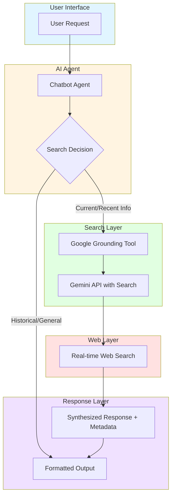
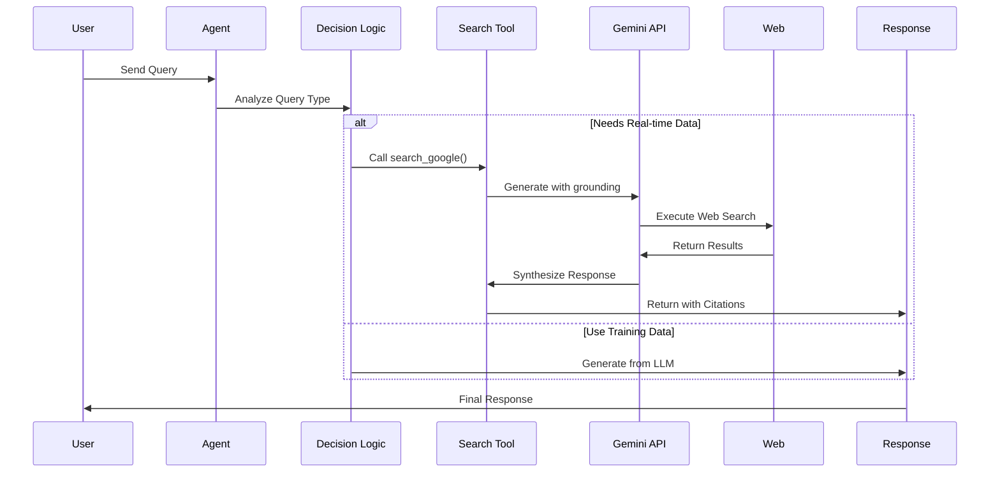
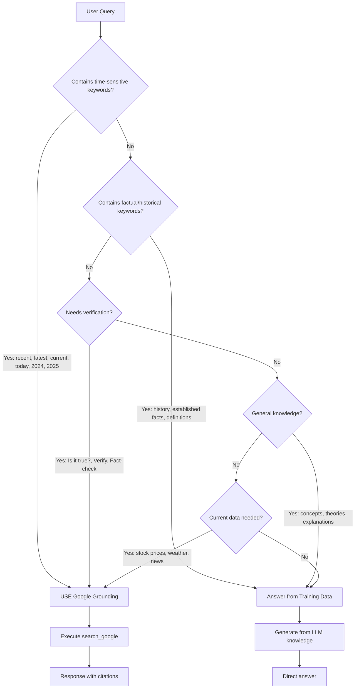

# Google Gemini Grounding Implementation Documentation

## Overview

Complete documentation for implementing Google Gemini Grounding with Search for AI Agent systems. This feature replaces SERPER API with more accurate real-time web search and citation capabilities.

## Table of Contents

1. [What is Google Grounding?](#what-is-google-grounding)
2. [System Architecture](#system-architecture)
3. [Modified Files](#modified-files)
4. [Implementation Details](#implementation-details)
5. [Configuration](#configuration)
6. [Usage](#usage)
7. [Features](#features)
8. [Troubleshooting](#troubleshooting)
9. [Appendix: Smart Search Logic](#appendix-smart-search-logic)

---

## What is Google Grounding?

Google Grounding is a Gemini API feature that connects AI models to real-time web content. It enables:

- **Real-time Information**: Access to the latest data from the internet
- **Factual Accuracy**: Reduces hallucinations by grounding responses in web data
- **Citations**: Every answer includes verifiable sources
- **Automatic Search**: The model determines when to perform searches automatically

### Advantages over SERPER:

| Feature | SERPER | Google Grounding |
|---------|--------|------------------|
| Real-time | Yes | Yes |
| Automatic Citations | No | Yes |
| Query Generation | Manual | Automatic |
| Response Synthesis | Manual | Automatic |
| Source Quality | Variable | Authoritative priority |
| Pricing | Per query | Per executed search |

---

## System Architecture



### Workflow:



1. **User Prompt** → Agent receives request
2. **Prompt Analysis** → Determines if web search is needed
3. **Decision Point** → Check for time-sensitive keywords
4. **Google Search** (if needed) → Automatically generates & executes search queries
5. **Result Processing** → Synthesizes information from search results
6. **Grounded Response** → Output with citations and sources
7. **groundingMetadata** → Structured data with web results

---

## Modified Files

### 1. `gmail-agent/server/chatbot.py`

**New Functions:**
- `create_grounding_tools()` - Replaces `create_serper_tools()`
- `search_google()` - Tool for grounded search
- `intelligent_search_decision()` - Determines when to search

**Key Changes:**
```python
# Before (SERPER)
def create_serper_tools():
    serper_api_key = os.environ.get("SERPER_API_KEY")
    # HTTP request to google.serper.dev

# After (Google Grounding)
def create_grounding_tools():
    from google import genai
    from google.genai import types
    
    grounding_tool = types.Tool(
        google_search=types.GoogleSearch()
    )
    
    config = types.GenerateContentConfig(
        tools=[grounding_tool]
    )
```

### 2. `gmail-agent/server/email_analysis_agents.py`

**Updated WebResearchAgent:**

```python
class WebResearchAgent:
    def __init__(self, google_api_key: str):
        self.llm = ChatGoogleGenerativeAI(...)
        # Removed: self.serper_api_key
        # Added: Google Grounding client
        
    async def conduct_research(self, research_plan: Dict) -> Dict:
        # Removed: HTTP request to Serper
        # Added: Gemini with grounding_tool
```

### 3. `gmail-agent/.env.example`

**Environment Configuration:**

```bash
# Before
SERPER_API_KEY=your-serper-api-key

# After  
GOOGLE_API_KEY=your-google-api-key  # REQUIRED for Grounding
```

### 4. `gmail-agent/requirements.txt`

**New Dependency:**

```
google-genai>=1.0.0
```

---

## Implementation Details

### 1. Google Grounding Client Setup

```python
from google import genai
from google.genai import types

def create_grounding_tools():
    google_api_key = os.environ.get("GOOGLE_API_KEY")
    
    @tool
    def search_google(query: str) -> str:
        # Initialize Gemini client
        client = genai.Client(api_key=google_api_key)
        
        # Create grounding tool
        grounding_tool = types.Tool(
            google_search=types.GoogleSearch()
        )
        
        # Configure generation
        config = types.GenerateContentConfig(
            tools=[grounding_tool]
        )
        
        # Generate with grounding
        response = client.models.generate_content(
            model="gemini-2.0-flash",
            contents=query,
            config=config,
        )
        
        return response.text
```

### 2. Extracting Citations from Metadata

```python
if response.candidates[0].grounding_metadata:
    metadata = response.candidates[0].grounding_metadata
    
    # Search queries used
    web_search_queries = metadata.web_search_queries
    
    # Web sources
    grounding_chunks = metadata.grounding_chunks
    for chunk in grounding_chunks:
        if chunk.web:
            uri = chunk.web.uri
            title = chunk.web.title
    
    # Text segments with citations
    grounding_supports = metadata.grounding_supports
    for support in grounding_supports:
        segment_text = support.segment.text
        chunk_indices = support.grounding_chunk_indices
```

### 3. Formatting Response with Citations

```python
def add_citations(response):
    text = response.text
    supports = response.candidates[0].grounding_metadata.grounding_supports
    chunks = response.candidates[0].grounding_metadata.grounding_chunks
    
    for support in supports:
        end_index = support.segment.end_index
        citation_links = []
        
        for i in support.grounding_chunk_indices:
            if i < len(chunks):
                uri = chunks[i].web.uri
                citation_links.append(f"[{i + 1}]({uri})")
        
        citation_string = ", ".join(citation_links)
        text = text[:end_index] + citation_string + text[end_index:]
    
    return text
```

---

## Configuration

### 1. Environment Variables

Add to `.env` file:

```bash
# Google API Key (REQUIRED)
GOOGLE_API_KEY=your-google-api-key-here

# Model Configuration (Optional)
GEMINI_MODEL=gemini-2.0-flash  # Default model for grounding
```

### 2. Getting Google API Key

1. Visit [Google AI Studio](https://makersuite.google.com/app/apikey)
2. Login with Google Account
3. Click "Create API Key"
4. Copy API key to `.env` file

### 3. Supported Models

| Model | Grounding Support | Notes |
|-------|-------------------|-------|
| gemini-2.0-flash | ✅ | Recommended, fastest |
| gemini-2.5-flash | ✅ | Newer version |
| gemini-2.5-pro | ✅ | Higher quality |

**Note:** Use `google_search` tool (not deprecated `google_search_retrieval`)

---

## Usage

### 1. Basic Search

```python
# Tool automatically available in agent
response = search_google("Who won the euro 2024?")
```

Output includes:
- Factual answer
- Citations [1], [2], [3]
- Links to sources

### 2. Political Quotes Research

```python
query = "Prabowo quotes on defense policy 2024"
response = search_google(query)

# Output format:
"Spain won Euro 2024, defeating England 2-1 in the final.[1](https://...), [2](https://...)"
```

### 3. Web Research Agent

```python
# Initialize with Google API Key
research_agent = WebResearchAgent(google_api_key="your-key")

# Conduct research with grounding
results = await research_agent.conduct_research({
    "search_queries": [
        "Prabowo economic policy 2024",
        "Indonesia defense budget latest"
    ]
})
```

---

## Features

### 1. Automatic Query Generation

Gemini automatically decides:
- Whether to perform a search
- What queries to run
- How many queries (usually 1-3 per prompt)

### 2. Real-Time Web Content

Access latest information:
- Current news
- Real-time political updates
- Latest economic data
- Social media posts

### 3. Structured Citations

Every response includes:
```json
{
  "groundingMetadata": {
    "webSearchQueries": ["query 1", "query 2"],
    "groundingChunks": [
      {
        "web": {
          "uri": "https://example.com",
          "title": "Source Title"
        }
      }
    ],
    "groundingSupports": [
      {
        "segment": {
          "startIndex": 0,
          "endIndex": 100,
          "text": "Factual statement"
        },
        "groundingChunkIndices": [0, 1]
      }
    ]
  }
}
```

### 4. Source Quality Prioritization

Google automatically prioritizes:
- Authoritative domains (.gov, .edu)
- Credible news outlets
- Official sources
- Fact-checking sites

### 5. Multi-Language Support

Grounding works with all Gemini-supported languages including:
- English
- Bahasa Indonesia
- Chinese
- Japanese
- And more

---

## Troubleshooting

### 1. Error: "GOOGLE_API_KEY not found"

**Solution:**
```bash
# Check environment variable
echo $GOOGLE_API_KEY

# Set manually
export GOOGLE_API_KEY="your-key-here"
```

### 2. Error: "google_search tool not available"

**Cause:** Model used doesn't support grounding

**Solution:**
```python
# Use compatible model
model="gemini-2.0-flash"  # ✅ Supports grounding

# Avoid experimental/preview models for production
```

### 3. Response has no citations

**Cause:** 
- Query doesn't require factual search
- Model determined no search needed

**Check:**
```python
if response.candidates[0].grounding_metadata:
    print("Grounding used")
else:
    print("No grounding - model answered from training data")
```

### 4. Slow Response Time

**Optimization:**
- Use `gemini-2.0-flash` (fastest)
- Limit number of queries per request
- Cache search results for repeated queries

### 5. Inaccurate Results

**Improvement:**
- Make queries more specific
- Add constraints like "latest", "official", "verified"
- Cross-check with multiple sources

---

## Best Practices

### 1. Query Optimization

```python
# ❌ Vague query
search_google("tell me about politics")

# ✅ Specific query  
search_google("Prabowo Subianto official statements on defense policy December 2024")
```

### 2. Error Handling

```python
@tool
def search_google(query: str) -> str:
    try:
        client = genai.Client(api_key=api_key)
        # ... setup grounding tool ...
        response = client.models.generate_content(...)
        
        # Check grounding
        if not response.candidates[0].grounding_metadata:
            return f"Response (no web search): {response.text}"
        
        return format_with_citations(response)
        
    except Exception as e:
        return f"Search error: {str(e)}"
```

### 3. Caching Strategy

```python
from functools import lru_cache

@lru_cache(maxsize=100)
def cached_search(query: str) -> str:
    return search_google(query)
```

---

## Comparison with SERPER

### SERPER (Before):
```python
# Manual query construction
url = "https://google.serper.dev/search"
payload = {"q": query}
response = requests.post(url, json=payload, headers=headers)
results = response.json()

# Manual parsing
organic = results["organic"]
for item in organic:
    title = item["title"]
    link = item["link"]
    snippet = item["snippet"]

# Manual synthesis to LLM
```

### Google Grounding (After):
```python
# Automatic grounding_tool = types.Tool(google_search=types.GoogleSearch())
config = types.GenerateContentConfig(tools=[grounding_tool])

# Single API call, everything automatic
response = client.models.generate_content(
    model="gemini-2.0-flash",
    contents=query,
    config=config
)

# Response already includes citations
```

---

## References

- [Google Grounding Documentation](https://ai.google.dev/gemini-api/docs/grounding)
- [Gemini API Pricing](https://ai.google.dev/gemini-api/docs/pricing)
- [Google AI Studio](https://makersuite.google.com/)
- [Gemini Cookbook - Search Grounding](https://colab.research.google.com/github/google-gemini/cookbook/blob/main/quickstarts/Search_Grounding.ipynb)

---

## Changelog

### v1.0.0 - Initial Implementation
- Replaced SERPER with Google Grounding
- Implemented in chatbot.py and email_analysis_agents.py
- Support for real-time web search
- Automatic citations and source attribution

### v1.1.0 - Enhanced Features
- Political quotes research with social media
- PDF generation with structured formatting
- Email formatting with visual structure
- AI-generated quote images for PDF

### v1.2.0 - Smart Search Intelligence
- Added intelligent decision logic for when to use web search vs training data
- Automatic detection of time-sensitive vs static knowledge queries
- Improved cost efficiency by reducing unnecessary search calls
- Better response quality for general knowledge questions

---

**Last Updated:** February 2026

**Author:** AI Assistant
**Project:** Composio Gmail Agent with Google Grounding

---

## Appendix: Smart Search Logic

### Basic Concept

The agent now has the ability to distinguish when to use web search (Google Grounding) and when to answer from training data.

### Decision Flow



### Search Usage Criteria

**MUST Search:**
- Recent events (2024-2026)
- Breaking news
- Real-time data
- Current social media
- Contemporary fact verification

**NO Search Needed:**
- History (pre-2024)
- General concepts
- Established theories
- Definitions
- Creative writing

### Implementation in Code

```python
# Inside chatbot.py
# Agent uses SYSTEM_PROMPT to determine:

if contains_recent_date(query) or contains_current_keywords(query):
    # Use Google Grounding
    response = search_google(query)
else:
    # Answer from training data
    response = llm.generate(query)
```

### Benefits

1. **Cost Efficiency**: Reduces API search usage for queries that don't need real-time data
2. **Response Speed**: Training data answers are faster
3. **Better UX**: General knowledge questions answered immediately without search delay
4. **Accuracy**: Still uses search for information that actually requires real-time verification

### Testing

```python
# Test case 1: Historical (NO search)
query = "When did World War II end?"
expected: Answer from training (1945)

# Test case 2: Current (USE search)
query = "Who won the Euro 2024?"
expected: Use search_google

# Test case 3: General knowledge (NO search)
query = "What is photosynthesis?"
expected: Answer from training

# Test case 4: Recent (USE search)
query = "Prabowo's latest cabinet announcement"
expected: Use search_google
```
