# Cara Kerja LangChain - Dokumentasi Lengkap

## Apa itu LangChain?

LangChain adalah framework untuk mengembangkan aplikasi dengan Large Language Models (LLMs). Framework ini menyediakan abstraksi dan tools untuk memudahkan integrasi LLM dengan data eksternal, APIs, dan agent-based workflows.

## Arsitektur Dasar LangChain

```mermaid
flowchart TB
    subgraph Core["🧩 LangChain Core"]
        direction TB
        LLM[Language Models]
        Prompt[Prompt Management]
        Chain[Chains]
        Agent[Agents]
        Memory[Memory]
    end
    
    subgraph Integrations["🔗 Integrations"]
        Vector[Vector Stores]
        DocLoad[Document Loaders]
        Tools[Tools]
        Callbacks[Callbacks]
    end
    
    subgraph App["🚀 Application"]
        User[User Input]
        Output[Output]
    end
    
    User --> Prompt
    Prompt --> Chain
    Chain --> LLM
    LLM --> Memory
    Chain --> Tools
    Tools --> Vector
    Tools --> DocLoad
    Chain --> Output
    Agent --> Chain
    
    style Core fill:#e1f5ff
    style Integrations fill:#fff4e1
    style App fill:#e1ffe1
```



---

## Komponen Utama LangChain

### 1. **Language Models (LLMs)**

```python
from langchain_groq import ChatGroq
from langchain_google_genai import ChatGoogleGenerativeAI

# Inisialisasi LLM
groq_llm = ChatGroq(
    model="llama-3.1-8b-instant",
    temperature=0,
    groq_api_key="your-key"
)

gemini_llm = ChatGoogleGenerativeAI(
    model="gemini-2.0-flash",
    temperature=0,
    google_api_key="your-key"
)

# Penggunaan dasar
response = groq_llm.invoke("Hello, how are you?")
print(response.content)
```

**Cara Kerja:**
- LLM wrappers menyediakan interface standar untuk berbagai model
- Input: String atau list of messages
- Output: AIMessage dengan content dan metadata
- Support untuk streaming, batching, dan async

---

### 2. **Prompt Templates**

```python
from langchain_core.prompts import ChatPromptTemplate

# Template sederhana
prompt = ChatPromptTemplate.from_template("Tell me a joke about {topic}")

# Template dengan system message
prompt = ChatPromptTemplate.from_messages([
    ("system", "You are a helpful assistant."),
    ("human", "What is {concept}?")
])

# Penggunaan
formatted_prompt = prompt.format(topic="programming")
response = llm.invoke(formatted_prompt)
```

**Cara Kerja:**
- Templates mendefinisikan struktur input untuk LLM
- Variable substitution dengan `{variable}`
- Support untuk few-shot prompting
- Messages dapat berupa: system, human, ai, tool

---

### 3. **Chains**

Chain adalah pipeline yang menghubungkan beberapa komponen.

```python
from langchain_core.runnables import RunnableSequence

# Chain sederhana
chain = prompt | llm

# Chain dengan output parser
from langchain_core.output_parsers import StrOutputParser

chain = prompt | llm | StrOutputParser()

# Penggunaan
result = chain.invoke({"topic": "AI"})
```

**Cara Kerja:**
- Operator `|` (pipe) menghubungkan komponen
- Output dari komponen A menjadi input komponen B
- Support untuk parallel execution, branching, dan conditional logic

**Visualisasi:**


---

### 4. **Agents**

Agent adalah sistem yang menggunakan LLM untuk memutuskan tindakan.

```python
from langchain.agents import create_react_agent
from langchain_core.tools import tool

# Define tools
@tool
def search(query: str) -> str:
    """Search the web."""
    return "Search results..."

@tool
def calculator(expression: str) -> str:
    """Calculate math expressions."""
    return str(eval(expression))

# Create agent
tools = [search, calculator]
agent = create_react_agent(llm, tools, prompt)

# Run agent
agent_executor = AgentExecutor(agent=agent, tools=tools)
response = agent_executor.invoke({"input": "What is 25 * 4?"})
```

**ReAct Pattern (Reasoning + Acting):**

```mermaid
sequenceDiagram
    participant User
    participant Agent
    participant LLM
    participant Tool
    
    User->>Agent: "What is weather in Jakarta?"
    
    loop Thought-Action-Observation
        Agent->>LLM: Thought: Need weather data
        LLM-->>Agent: Action: use weather_tool
        Agent->>Tool: Call weather_tool(city="Jakarta")
        Tool-->>Agent: Observation: 30°C, sunny
    end
    
    Agent->>LLM: Final answer synthesis
    LLM-->>Agent: "Weather in Jakarta is 30°C..."
    Agent-->>User: Final response
```



**Cara Kerja ReAct:**
1. **Thought**: LLM memikirkan apa yang perlu dilakukan
2. **Action**: LLM memutuskan tool mana yang digunakan
3. **Observation**: Agent melihat hasil dari tool
4. **Repeat**: Jika perlu, loop sampai task selesai
5. **Final Answer**: LLM memberikan jawaban akhir

---

### 5. **Memory**

Memory menyimpan konteks percakapan.

```python
from langchain.memory import ConversationBufferMemory

# Inisialisasi memory
memory = ConversationBufferMemory()

# Save context
memory.save_context(
    {"input": "Hi, I'm John"},
    {"output": "Hello John! How can I help?"}
)

# Load context
context = memory.load_memory_variables({})
print(context["history"])
```

**Tipe Memory:**

| Tipe | Deskripsi | Use Case |
|------|-----------|----------|
| `ConversationBufferMemory` | Simpan semua messages | Short conversations |
| `ConversationBufferWindowMemory` | Simpan N messages terakhir | Long conversations |
| `ConversationSummaryMemory` | Summarize percakapan | Very long conversations |
| `VectorStoreRetrieverMemory` | Retrieve relevant context dari vector store | Large knowledge bases |

---

## Integrasi dengan Project Gmail Agent

### Bagaimana LangChain Digunakan di Project Ini


---

### 1. **LLM Integration**

```python
# File: gmail-agent/server/chatbot.py

def get_llm_with_fallback(groq_api_key: str):
    """
    Get LLM with fallback: Groq -> Google Gemini
    """
    # Try Groq first
    if groq_api_key:
        try:
            llm = ChatGroq(
                model="llama-3.1-8b-instant",
                temperature=0,
                groq_api_key=groq_api_key
            )
            return llm, "groq"
        except Exception as e:
            print(f"Groq init failed: {e}")
    
    # Fallback to Gemini
    if google_api_key:
        try:
            llm = ChatGoogleGenerativeAI(
                model="gemini-2.0-flash",
                temperature=0,
                google_api_key=google_api_key
            )
            return llm, "gemini"
        except Exception as e:
            print(f"Gemini init failed: {e}")
```

**Cara Kerja:**
- LangChain menyediakan interface standar untuk berbagai LLM
- Fallback otomatis jika primary LLM gagal
- Temperature dan parameter dapat dikonfigurasi

---

### 2. **Tool Definition**

```python
# File: gmail-agent/server/chatbot.py

from langchain_core.tools import tool

@tool
def search_google(query: str) -> str:
    """
    Search Google using Gemini with Grounding.
    
    Args:
        query: The search query.
    
    Returns:
        Search results with citations.
    """
    # Implementation...
    return response.text

@tool
def generate_pdf_report_wrapped(
    markdown_content: str,
    filename: str = "report.pdf",
    sender_email: str = "AI Assistant"
) -> str:
    """
    Generate a professional PDF report.
    
    Returns:
        The ABSOLUTE FILE PATH.
    """
    path = generate_pdf_report.invoke({...})
    return path
```

**Cara Kerja:**
- Decorator `@tool` mengkonversi fungsi menjadi LangChain Tool
- Docstring menjadi description untuk agent
- Type hints digunakan untuk schema validation
- Tools dapat dipanggil oleh agent secara otomatis

---

### 3. **Agent Creation**

```python
# File: gmail-agent/server/chatbot.py

from langgraph.prebuilt import create_react_agent

def get_agent_tools(user_id: str):
    """Create all tools for the agent."""
    # Gmail Tools
    gmail_tools = [gmail_send_email, gmail_create_draft, gmail_fetch_emails]
    
    # Search Tools
    search_tools = create_grounding_tools()
    
    # PDF Generator
    pdf_tool = generate_pdf_report_wrapped
    
    return search_tools + [pdf_tool] + gmail_tools

def create_agent(llm, provider_name):
    """Factory function untuk membuat agent."""
    tools = get_agent_tools(user_id)
    
    return create_react_agent(
        model=llm,
        tools=tools,
        prompt=SYSTEM_PROMPT,
    )
```

**Cara Kerja:**
- `create_react_agent` membuat agent dengan ReAct pattern
- Agent mendapatkan: LLM + Tools + System Prompt
- Agent secara otomatis memutuskan kapan menggunakan tools
- LangGraph mengelola state dan execution loop

---

### 4. **Agent Execution**

```python
# File: gmail-agent/server/chatbot.py

async def chat(user_message: str, groq_api_key: str, user_id: str, ...):
    """
    Main chat function dengan LangGraph agent.
    """
    # 1. Setup Tools
    tools = get_agent_tools(user_id)
    
    # 2. Create Agent Factory
    def create_agent(llm, provider_name):
        return create_react_agent(
            model=llm,
            tools=tools,
            prompt=SYSTEM_PROMPT,
        )
    
    # 3. Prepare Input
    formatted_history = convert_history(conversation_history)
    inputs = {
        "messages": formatted_history + [HumanMessage(content=user_message)]
    }
    
    # 4. Execute dengan Fallback
    state, provider_used = await run_agent_with_fallback(
        create_agent, inputs, groq_api_key
    )
    
    # 5. Extract Response
    last_message = state["messages"][-1]
    return {
        "type": "final_result",
        "message": last_message.content
    }
```

**Alur Eksekusi:**


---

### 5. **Multi-Agent dengan LangChain**

```python
# File: gmail-agent/server/email_analysis_agents.py

from langchain_google_genai import ChatGoogleGenerativeAI

class EmailAnalysisAgent:
    """Agent untuk analisis email."""
    
    def __init__(self, google_api_key: str):
        # Inisialisasi LLM via LangChain
        self.llm = ChatGoogleGenerativeAI(
            model="gemini-2.0-flash",
            temperature=0.2,
            google_api_key=google_api_key
        )
    
    async def analyze_email(self, email_content: str, user_query: str):
        # Menggunakan LangChain untuk generate structured output
        system_prompt = """You are an expert email analysis AI..."""
        
        response = await self.llm.ainvoke([
            SystemMessage(content=system_prompt),
            HumanMessage(content=user_prompt)
        ])
        
        # Parse JSON response
        return json.loads(response.content)
```

**Cara Kerja Multi-Agent:**
- Setiap agent adalah instance class dengan LLM sendiri
- Agents bekerja secara sequential (pipeline)
- Output dari agent A menjadi input agent B
- Tidak menggunakan LangGraph untuk multi-agent ini, tapi LangChain untuk LLM calls

---

## Konsep Penting LangChain

### 1. **Runnable Interface**

Semua komponen di LangChain mengimplementasikan interface `Runnable`:

```python
from langchain_core.runnables import Runnable

# Semua ini adalah Runnable:
# - LLMs
# - Prompts
# - Chains
# - Agents

# Methods yang tersedia:
.run()          # Sync execution
.ainvoke()      # Async execution  
.batch()        # Batch processing
.stream()       # Streaming response
```

### 2. **LCEL (LangChain Expression Language)**

```python
# Chain dengan LCEL
chain = (
    prompt 
    | llm 
    | output_parser
)

# Parallel execution
from langchain_core.runnables import RunnableParallel

parallel_chain = RunnableParallel(
    analysis=analysis_chain,
    summary=summary_chain
)

# Conditional
from langchain_core.runnables import RunnableBranch

branch = RunnableBranch(
    (lambda x: x["topic"] == "math", math_chain),
    (lambda x: x["topic"] == "science", science_chain),
    default_chain
)
```

### 3. **Output Parsing**

```python
from langchain_core.output_parsers import (
    StrOutputParser,
    JsonOutputParser,
    PydanticOutputParser
)
from pydantic import BaseModel

# String parser
str_parser = StrOutputParser()

# JSON parser
json_parser = JsonOutputParser()

# Pydantic parser
class Analysis(BaseModel):
    summary: str
    claims: list[str]
    confidence: float

pydantic_parser = PydanticOutputParser(pydantic_object=Analysis)

# Usage in chain
chain = prompt | llm | pydantic_parser
result = chain.invoke({"text": email_content})
# Result adalah instance Analysis class
```

### 4. **Callbacks**

```python
from langchain.callbacks import StreamingStdOutCallbackHandler

# Streaming callback
llm = ChatGroq(
    callbacks=[StreamingStdOutCallbackHandler()],
    streaming=True
)

# Custom callback
from langchain.callbacks.base import BaseCallbackHandler

class MyCallback(BaseCallbackHandler):
    def on_llm_start(self, serialized, prompts, **kwargs):
        print("LLM started!")
    
    def on_llm_end(self, response, **kwargs):
        print("LLM finished!")
    
    def on_tool_start(self, serialized, input_str, **kwargs):
        print(f"Tool {serialized['name']} started with input: {input_str}")
```

---

## LangGraph untuk Agent Workflows

LangGraph adalah ekstensi LangChain untuk membuat complex agent workflows dengan graphs.

### Basic Graph

```python
from langgraph.graph import StateGraph, END

# Define state
class AgentState:
    messages: list
    next_step: str

# Create graph
workflow = StateGraph(AgentState)

# Add nodes
workflow.add_node("analyze", analyze_node)
workflow.add_node("research", research_node)
workflow.add_node("report", report_node)

# Add edges
workflow.set_entry_point("analyze")
workflow.add_edge("analyze", "research")
workflow.add_edge("research", "report")
workflow.add_edge("report", END)

# Compile
app = workflow.compile()

# Run
result = app.invoke({"messages": ["Initial query"]})
```

### Conditional Edges

```python
# Conditional routing
def decide_next_step(state):
    if state["needs_research"]:
        return "research"
    return "report"

workflow.add_conditional_edges(
    "analyze",
    decide_next_step,
    {
        "research": "research",
        "report": "report"
    }
)
```

### ReAct Agent dengan LangGraph

```python
from langgraph.prebuilt import create_react_agent

# LangGraph mempermudah pembuatan ReAct agent
agent = create_react_agent(
    model=llm,
    tools=tools,
    prompt=system_prompt
)

# State management otomatis
# - Thought tracking
# - Tool call history
# - Message history
```

---

## Best Practices

### 1. **Error Handling**

```python
from langchain_core.runnables import RunnableConfig

try:
    result = await chain.ainvoke(
        {"query": user_query},
        config=RunnableConfig(callbacks=[my_handler])
    )
except Exception as e:
    logger.error(f"Chain failed: {e}")
    # Fallback logic
```

### 2. **Caching**

```python
from functools import lru_cache

@lru_cache(maxsize=100)
def cached_llm_call(prompt: str) -> str:
    return llm.invoke(prompt).content
```

### 3. **Rate Limiting**

```python
from langchain_core.rate_limiters import InMemoryRateLimiter

rate_limiter = InMemoryRateLimiter(
    requests_per_second=0.5,
    check_every_n_seconds=1
)

llm = ChatGroq(rate_limiter=rate_limiter)
```

### 4. **Tracing**

```python
# Enable tracing dengan LangSmith
import os
os.environ["LANGCHAIN_TRACING_V2"] = "true"
os.environ["LANGCHAIN_API_KEY"] = "your-api-key"
os.environ["LANGCHAIN_PROJECT"] = "gmail-agent"

# Semua calls akan ditrace otomatis
```

---

## Perbandingan: LangChain vs Pure LLM Calls

### Tanpa LangChain (Pure API Calls):

```python
import requests

# Groq API call
response = requests.post(
    "https://api.groq.com/openai/v1/chat/completions",
    headers={"Authorization": f"Bearer {api_key}"},
    json={
        "model": "llama-3.1-8b-instant",
        "messages": [{"role": "user", "content": "Hello"}]
    }
)
result = response.json()["choices"][0]["message"]["content"]

# Gemini API call
genai.configure(api_key=api_key)
model = genai.GenerativeModel('gemini-pro')
response = model.generate_content("Hello")
result = response.text

# Problem: Different APIs, different formats, no chaining
```

### Dengan LangChain:

```python
from langchain_groq import ChatGroq
from langchain_google_genai import ChatGoogleGenerativeAI

# Unified interface
groq = ChatGroq(model="llama-3.1-8b-instant")
gemini = ChatGoogleGenerativeAI(model="gemini-2.0-flash")

# Same invocation pattern
response1 = groq.invoke("Hello")
response2 = gemini.invoke("Hello")

# Easy chaining
chain = prompt | groq | output_parser
result = chain.invoke({"topic": "AI"})

# Automatic fallback
def get_llm():
    try:
        return ChatGroq(...)
    except:
        return ChatGoogleGenerativeAI(...)
```

---

## Kesimpulan

LangChain menyederhanakan pengembangan aplikasi LLM dengan menyediakan:

1. **Unified Interface** - Satu cara untuk berinteraksi dengan berbagai LLM
2. **Modular Components** - Prompts, chains, agents, tools dapat dikombinasikan
3. **Agent Framework** - Built-in ReAct pattern dan agent loops
4. **Integrations** - 100+ integrations dengan external services
5. **Production Ready** - Caching, tracing, rate limiting, error handling

Di project Gmail Agent, LangChain digunakan untuk:
- **LLM abstraction** - Groq + Gemini dengan interface sama
- **Tool system** - 11 tools untuk search, email, PDF
- **Agent orchestration** - ReAct agent dengan automatic tool selection
- **Multi-agent pipeline** - 4 specialized agents untuk email analysis

---

## Referensi

- [LangChain Documentation](https://python.langchain.com/docs/get_started/introduction)
- [LangGraph Documentation](https://langchain-ai.github.io/langgraph/)
- [LangChain API Reference](https://api.python.langchain.com/)
- [Integration Hub](https://integrations.langchain.com/)

---

**Dibuat:** February 2026  
**Versi:** LangChain 0.3.x, LangGraph 0.2.x
