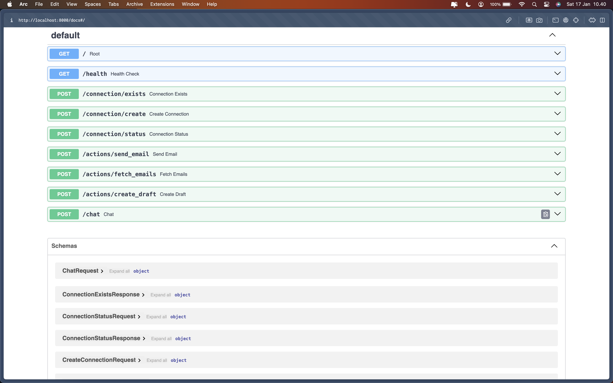
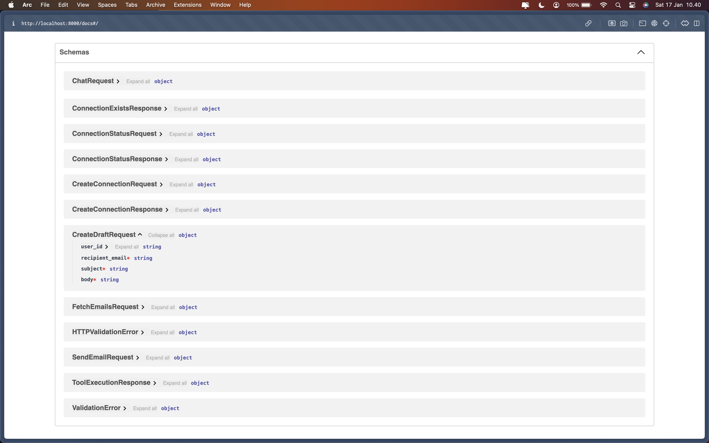
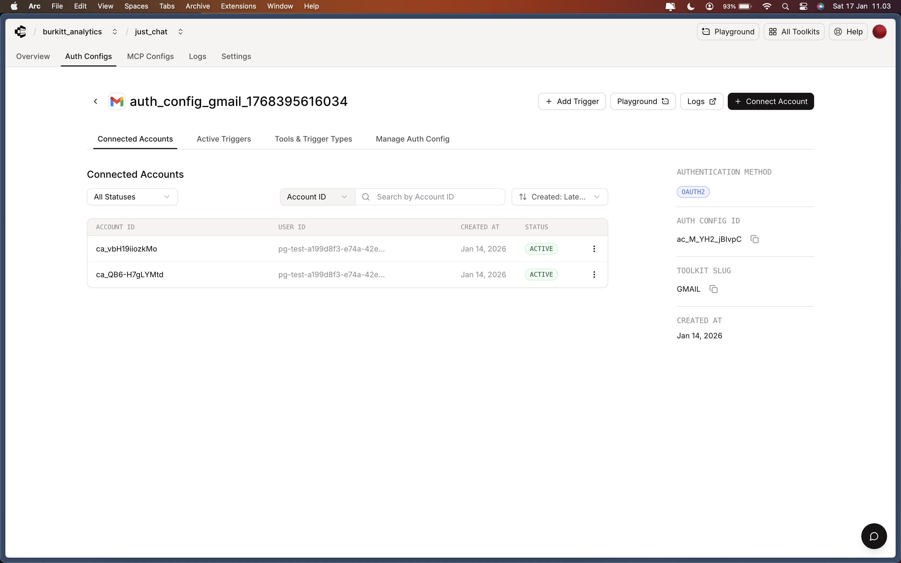
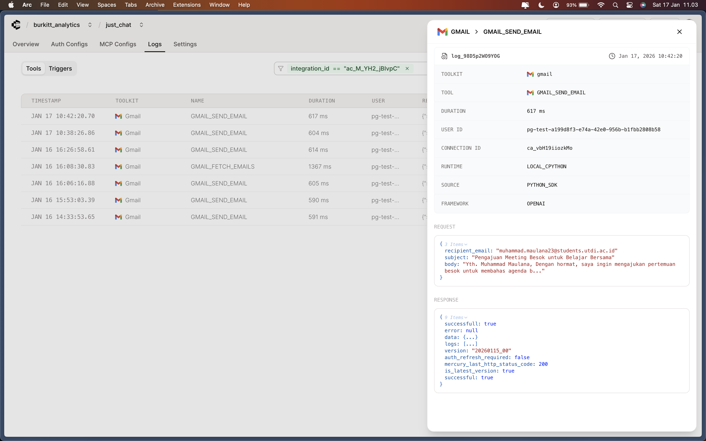
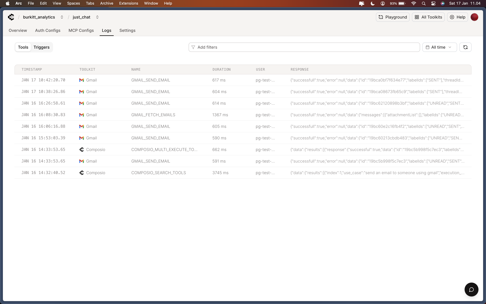

# Screenshots & Demo

This page contains screenshots and demo video for the Gmail Agent application.

---

## Screenshots

### 1. API Swagger Documentation



The FastAPI automatic Swagger documentation interface showing all available endpoints.

---

### 2. API Schemas (Swagger)



Detailed view of the API request/response schemas in Swagger documentation.

---

### 3. Authentication Documentation



Documentation showing the authentication flow and connection management.

---

### 4. Logs Documentation



Server logs showing API requests and responses.

---

### 5. List Logs Documentation



Detailed list of log entries for debugging and monitoring.

---

## Demo Video

### 📹 Demo Recording

**Video File:** [recorder_docs.mp4](recorder_docs.mp4)

This video demonstrates:

1. **Project Overview**
   - Application architecture
   - Technologies used (FastAPI, Next.js, Composio, Groq)

2. **Backend Features**
   - API endpoints demonstration
   - Swagger documentation walkthrough
   - Gmail connection flow

3. **Frontend Features**
   - Chat interface demonstration
   - Sending emails via natural language
   - Fetching recent emails
   - Creating email drafts

4. **Code Walkthrough**
   - Backend file structure
   - Frontend components
   - API integration

---

## Screenshot Descriptions

| File | Description |
|------|-------------|
| `api_swagger.png` | Main Swagger UI showing all API endpoints |
| `api_schemas_swagger.png` | API schemas and data models |
| `auth_documentation.png` | Authentication/connection documentation |
| `logs_documentation.png` | Server logs view |
| `list_logs-documentation.png` | Detailed logs listing |
| `recorder_docs.mp4` | Full demo video recording |

---

## Adding More Screenshots

To add additional screenshots:

1. Take the screenshot (PNG format recommended)
2. Save it in the `docs/` folder
3. Add reference in this file:

```markdown
### Screenshot Title


Description of what the screenshot shows.
```

---

## Video Playback

The demo video (`recorder_docs.mp4`) can be played with:

- Any modern web browser
- VLC Media Player
- QuickTime (macOS)
- Windows Media Player

Or embed in documentation platforms that support video.
