# Specialized Agent Systems Development Plan

## Overview

This document outlines the development plan for two specialized agent systems to extend the existing AI Agent ecosystem:

1. **Strategy Diagram Agent** - Generates strategic diagrams and charts from prompts
2. **Dossier/Meeting Prep Agent** - Creates comprehensive meeting preparation documents

Both agents will integrate with the existing architecture and leverage the current tool ecosystem and LLM providers.

## System Architecture Integration

### Current System Context
The existing system uses:
- **LLM Providers**: Groq (LLaMA 3.1 8B Instant) and Google Gemini 2.0 Flash with fallback mechanisms
- **Agent Framework**: LangGraph with ReAct patterns
- **Tool Ecosystem**: Search tools, Gmail integration, PDF generation, Composio integrations
- **API Layer**: RESTful endpoints with streaming support

### Integration Points

```mermaid
flowchart TB
    subgraph Existing["🔧 Existing System"]
        API[API Layer]
        AGENTS[Agent Framework]
        TOOLS[Tool Ecosystem]
        LLM[LLM Providers]
    end
    
    subgraph New["🚀 New Agents"]
        STRATEGY[Strategy Diagram Agent]
        DOSSIER[Dossier/Meeting Prep Agent]
    end
    
    subgraph ExtTools["🛠️ Extended Tools"]
        BROWSER[Composio Browser]
        SERPER[Serper API]
        LINKEDIN[LinkedIn Integration]
        MERMAID[Mermaid.js Generator]
        GRAPHVIZ[Graphviz Generator]
    end
    
    API --> STRATEGY
    API --> DOSSIER
    STRATEGY --> AGENTS
    DOSSIER --> AGENTS
    STRATEGY --> ExtTools
    DOSSIER --> ExtTools
    AGENTS --> TOOLS
    AGENTS --> LLM
```


## Agent 1: Strategy Diagram Agent

### Specifications
- **Input**: Text prompt describing desired strategy diagram
- **Output**: Mermaid.js or Graphviz code for visual representation
- **Primary LLM**: Claude Sonnet 4.5 (code generation)
- **Strategic LLM**: OpenAI o3 (strategic reasoning only)
- **Processing Flow**: Stakeholder Analysis → Strategic Reasoning → Diagram Code Generation

### Detailed Workflow


### Implementation Components

#### 1. Core Agent Class (`strategy_diagram_agent.py`)
```python
class StrategyDiagramAgent:
    def __init__(self):
        self.o3_client = OpenAI()  # For strategic reasoning
        self.claude_client = Anthropic()  # For code generation
        self.mermaid_validator = MermaidValidator()
        self.graphviz_validator = GraphvizValidator()
    
    async def generate_strategy_diagram(self, prompt: str, format_type: str = "mermaid"):
        # Step 1: Strategic analysis with o3
        strategic_analysis = await self.analyze_strategically(prompt)
        
        # Step 2: Generate diagram code with Claude
        diagram_code = await self.generate_diagram_code(strategic_analysis, format_type)
        
        # Step 3: Validate and return
        validated_code = await self.validate_diagram(diagram_code, format_type)
        
        return {
            "strategic_analysis": strategic_analysis,
            "diagram_code": validated_code,
            "format": format_type
        }
```

#### 2. Strategic Reasoning Module (`strategic_reasoning.py`)
```python
class StrategicReasoning:
    def __init__(self):
        self.stakeholder_analyzer = StakeholderAnalyzer()
        self.relationship_mapper = RelationshipMapper()
    
    async def analyze_stakeholders_and_relationships(self, prompt: str):
        # Use o3 for deep strategic analysis
        analysis_prompt = f"""
        Analyze the following strategic situation and provide:
        1. Key stakeholders and their roles
        2. Power relationships and influence patterns
        3. Strategic objectives and constraints
        4. Recommended visual representation approach
        
        Prompt: {prompt}
        """
        
        # Call OpenAI o3 for strategic reasoning
        return await self.call_o3_api(analysis_prompt)
```

#### 3. Diagram Code Generation Module (`diagram_generator.py`)
```python
class DiagramCodeGenerator:
    def __init__(self):
        self.mermaid_templates = MermaidTemplateLibrary()
        self.graphviz_templates = GraphvizTemplateLibrary()
    
    async def generate_mermaid_code(self, strategic_analysis: dict):
        prompt = f"""
        Based on the strategic analysis, generate Mermaid.js code:
        
        {strategic_analysis}
        
        Generate a clean, professional Mermaid diagram that effectively visualizes:
        - Stakeholder relationships
        - Strategic flow
        - Decision points
        - Key interactions
        
        Return only the valid Mermaid code.
        """
        
        # Use Claude Sonnet 4.5 for code generation
        return await self.call_claude_api(prompt)
```

### API Endpoints
```python
@app.post("/strategy-diagram")
async def create_strategy_diagram(request: StrategyDiagramRequest):
    """Generate strategy diagram from prompt"""
    
@app.post("/strategy-diagram/validate")
async def validate_diagram_code(request: DiagramValidationRequest):
    """Validate Mermaid/Graphviz code"""
```

## Agent 2: Dossier/Meeting Prep Agent

### Specifications
- **Input**: Name + LinkedIn URL
- **Output**: One-page dossier with bio, statements, associates, conversation starters
- **Primary LLM**: Gemini 3 Pro (1M token context for research synthesis)
- **Strategic LLM**: OpenAI o3 (relationship mapping and insights)
- **Data Sources**: Google Search, Serper API, LinkedIn public profiles, internal RAG

### Detailed Workflow


### Implementation Components

#### 1. Core Agent Class (`dossier_agent.py`)
```python
class DossierAgent:
    def __init__(self):
        self.gemini_client = genai.GenerativeModel('gemini-3-pro')  # Research synthesis
        self.o3_client = OpenAI()  # Relationship mapping
        self.web_searcher = WebSearcher()  # Serper integration
        self.linkedin_scraper = LinkedInScraper()  # Composio integration
        self.rag_retriever = RAGRetriever()  # Internal notes
    
    async def generate_dossier(self, name: str, linkedin_url: str):
        # Step 1: Multi-source data collection
        web_data = await self.collect_web_data(name)
        linkedin_data = await self.collect_linkedin_data(linkedin_url)
        internal_notes = await self.rag_retriever.search(name)
        
        # Step 2: Synthesize with Gemini 3 Pro
        synthesized_data = await self.synthesize_research(web_data, linkedin_data, internal_notes)
        
        # Step 3: Strategic analysis with o3
        strategic_insights = await self.generate_strategic_insights(synthesized_data)
        
        # Step 4: Generate final dossier
        dossier = await self.create_dossier_document(synthesized_data, strategic_insights)
        
        return dossier
```

#### 2. Data Collection Module (`data_collector.py`)
```python
class DataCollector:
    def __init__(self):
        self.serper_client = SerperClient()
        self.linkedin_client = LinkedInClient()
        self.news_aggregator = NewsAggregator()
    
    async def collect_web_data(self, name: str):
        """Collect comprehensive web data"""
        searches = [
            f"{name} recent news statements interviews",
            f"{name} biography career background",
            f"{name} votes positions opinions",
            f"{name} associates colleagues network"
        ]
        
        results = {}
        for search_query in searches:
            results[search_query] = await self.serper_client.search(search_query)
        
        return results
    
    async def collect_linkedin_data(self, linkedin_url: str):
        """Extract LinkedIn profile data using Composio"""
        try:
            profile_data = await self.linkedin_client.get_profile(linkedin_url)
            return {
                "experience": profile_data.get("experience", []),
                "education": profile_data.get("education", []),
                "skills": profile_data.get("skills", []),
                "connections": profile_data.get("connections", 0),
                "recent_activity": profile_data.get("recent_activity", [])
            }
        except Exception as e:
            print(f"LinkedIn data collection failed: {e}")
            return {}
```

#### 3. Dossier Generation Module (`dossier_generator.py`)
```python
class DossierGenerator:
    def __init__(self):
        self.template_engine = DossierTemplateEngine()
    
    async def create_dossier_document(self, research_data: dict, strategic_insights: dict):
        """Generate comprehensive one-page dossier"""
        
        dossier_sections = {
            "biographical_context": self.extract_biography(research_data),
            "recent_statements": self.extract_recent_statements(research_data),
            "known_associates": self.extract_associates(research_data),
            "strategic_insights": strategic_insights,
            "conversation_starters": self.generate_conversation_starters(research_data, strategic_insights),
            "topics_to_avoid": self.identify_sensitive_topics(research_data),
            "relationship_mapping": strategic_insights.get("relationship_mapping", {})
        }
        
        return await self.template_engine.render_dossier(dossier_sections)
```

### API Endpoints
```python
@app.post("/dossier/generate")
async def generate_dossier(request: DossierRequest):
    """Generate comprehensive meeting prep dossier"""
    
@app.get("/dossier/{dossier_id}")
async def get_dossier(dossier_id: str):
    """Retrieve previously generated dossier"""
    
@app.post("/dossier/update")
async def update_dossier(dossier_id: str, request: DossierUpdateRequest):
    """Update existing dossier with new information"""
```

## Development Timeline & Milestones

### Phase 1: Foundation & Core Infrastructure (Weeks 1-2)
- [ ] Set up project structure for both agents
- [ ] Implement base agent classes inheriting from existing framework
- [ ] Set up API key management for OpenAI o3, Claude Sonnet 4.5, Gemini 3 Pro
- [ ] Implement basic error handling and fallback mechanisms
- [ ] Create database schemas for storing generated content

### Phase 2: Strategy Diagram Agent (Weeks 3-4)
- [ ] Implement strategic reasoning module with OpenAI o3 integration
- [ ] Build Mermaid.js code generation with Claude Sonnet 4.5
- [ ] Add Graphviz support as alternative
- [ ] Implement diagram validation and rendering
- [ ] Create API endpoints and test with sample prompts
- [ ] Add rate limiting and cost tracking

### Phase 3: Dossier/Meeting Prep Agent (Weeks 5-6)
- [ ] Implement web search integration with Serper API
- [ ] Build LinkedIn data extraction using Composio
- [ ] Set up Gemini 3 Pro for research synthesis
- [ ] Create dossier template system
- [ ] Implement strategic insights generation with o3
- [ ] Add caching and data persistence

### Phase 4: Integration & Testing (Weeks 7-8)
- [ ] Integrate both agents with existing API layer
- [ ] Implement comprehensive testing suite
- [ ] Add monitoring and logging
- [ ] Performance optimization and rate limiting
- [ ] Documentation and user guides
- [ ] Security review and privacy compliance

### Phase 5: Deployment & Monitoring (Weeks 9-10)
- [ ] Deploy to staging environment
- [ ] Conduct user acceptance testing
- [ ] Implement monitoring and alerting
- [ ] Deploy to production
- [ ] Collect feedback and iterate

## Technical Requirements

### Dependencies & Libraries
```python
# New dependencies to add to requirements.txt:
anthropic>=0.34.0  # Claude Sonnet 4.5
openai>=1.12.0     # OpenAI o3
google-generativeai>=0.8.0  # Gemini 3 Pro
serper>=0.2.0      # Web search API
linkedin-api>=2.0.0  # LinkedIn integration (via Composio)
mermaid-py>=0.5.0  # Mermaid.js validation
graphviz>=0.20.0   # Graphviz support
beautifulsoup4>=4.12.0  # Web scraping
newspaper3k>=0.2.8  # News article extraction
```

### Environment Variables
```bash
# New environment variables needed:
OPENAI_O3_API_KEY=your_o3_api_key
ANTHROPIC_API_KEY=your_claude_api_key
GEMINI_PRO_API_KEY=your_gemini_pro_key
SERPER_API_KEY=your_serper_key
LINKEDIN_CLIENT_ID=your_linkedin_client_id
LINKEDIN_CLIENT_SECRET=your_linkedin_client_secret
```

### Database Schema Extensions
```sql
-- Strategy diagrams table
CREATE TABLE strategy_diagrams (
    id UUID PRIMARY KEY,
    user_id VARCHAR(255),
    prompt TEXT,
    strategic_analysis JSONB,
    diagram_code TEXT,
    format_type VARCHAR(50),
    created_at TIMESTAMP,
    updated_at TIMESTAMP
);

-- Dossiers table
CREATE TABLE dossiers (
    id UUID PRIMARY KEY,
    user_id VARCHAR(255),
    target_name VARCHAR(255),
    linkedin_url TEXT,
    research_data JSONB,
    strategic_insights JSONB,
    dossier_content TEXT,
    created_at TIMESTAMP,
    updated_at TIMESTAMP
);

-- API usage tracking
CREATE TABLE api_usage (
    id UUID PRIMARY KEY,
    user_id VARCHAR(255),
    agent_type VARCHAR(50),
    api_provider VARCHAR(50),
    tokens_used INTEGER,
    cost DECIMAL(10, 6),
    created_at TIMESTAMP
);
```

## Cost Considerations

### API Pricing Estimates
- **OpenAI o3**: ~$30 per 1M tokens (strategic reasoning only)
- **Claude Sonnet 4.5**: ~$3 per 1M tokens (code generation)
- **Gemini 3 Pro**: ~$0.5 per 1M tokens (research synthesis)
- **Serper API**: $5 per 1000 searches

### Cost Control Measures
- Implement token usage tracking and limits
- Add caching for repeated requests
- Use cheaper models for simple tasks
- Implement user-based quotas
- Monitor usage patterns and optimize prompts

## Privacy & Compliance

### Data Handling
- Only use publicly available information
- Implement data retention policies
- Add user consent mechanisms
- Secure storage of personal data
- GDPR compliance considerations

### Security Measures
- Rate limiting per user
- API key rotation
- Input sanitization
- Output validation
- Audit logging

## Success Metrics

### Technical Metrics
- API response time < 30 seconds
- 99%+ uptime
- Error rate < 1%
- Cost per request within budget

### Business Metrics
- User satisfaction score > 4.5/5
- Daily active users growth
- Feature adoption rate
- Retention rate > 80%

## Next Steps

1. **Immediate Actions**:
   - Set up API keys and access to new LLM providers
   - Create project structure for both agents
   - Begin Phase 1 development

2. **Resource Allocation**:
   - Assign 2 developers for 10 weeks
   - Budget for API costs during development
   - Allocate testing resources

3. **Risk Mitigation**:
   - Have backup LLM providers
   - Implement graceful degradation
   - Monitor API costs closely
   - Prepare rollback plan

This development plan provides a comprehensive roadmap for implementing both specialized agents while integrating seamlessly with the existing AI Agent ecosystem.