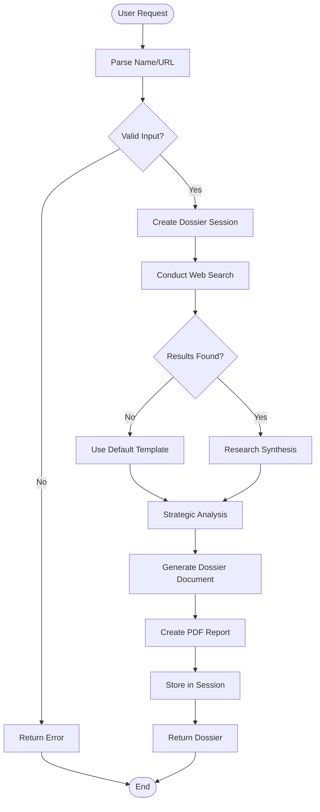

# Dossier Agent Documentation

## Overview

The **Dossier Agent** generates comprehensive meeting preparation dossiers and biographical profiles. It conducts research on individuals or organizations and creates strategic briefing documents with actionable insights.

---

## Architecture

```
┌─────────────────────────────────────────────────────────────────┐
│                    Dossier Plugin Agent                         │
├─────────────────────────────────────────────────────────────────┤
│                                                                 │
│  ┌─────────────────────────────────────────────────────────┐   │
│  │                  Dossier Agent Pipeline                 │   │
│  │                                                         │   │
│  │   ┌─────────────┐                                      │   │
│  │   │   Collect   │───▶ Data Input (Name/LinkedIn URL)   │   │
│  │   │    Data     │                                      │   │
│  │   └──────┬──────┘                                      │   │
│  │          │                                             │   │
│  │          ▼                                             │   │
│  │   ┌─────────────┐     ┌─────────────┐                 │   │
│  │   │ Web Search  │────▶│  Synthesize │                 │   │
│  │   │  (Serper)   │     │  Research   │                 │   │
│  │   └─────────────┘     └──────┬──────┘                 │   │
│  │                              │                        │   │
│  │                              ▼                        │   │
│  │   ┌─────────────┐     ┌─────────────┐                 │   │
│  │   │   Strategic │◀────│   Generate  │                 │   │
│  │   │   Analysis  │     │   Dossier   │                 │   │
│  │   └─────────────┘     └──────┬──────┘                 │   │
│  │                              │                        │   │
│  │                              ▼                        │   │
│  │   ┌─────────────┐                                     │   │
│  │   │ PDF Report  │                                     │   │
│  │   │  Generated  │                                     │   │
│  │   └─────────────┘                                     │   │
│  │                                                         │   │
│  └─────────────────────────────────────────────────────────┘   │
│                                                                 │
└─────────────────────────────────────────────────────────────────┘
```

---

## Flowchart



---

## Agent Structure

```python
class DossierPluginAgent(BaseAgent):
    """
    Dossier Agent for meeting preparation and biographical research
    """
    
    # Configuration
    name = "dossier"
    description = "Meeting preparation and comprehensive biographical dossiers"
    keywords = ["dossier", "meeting prep", "research person", "profiling"]
    active_statuses = ["collecting", "researching", "analyzing", "generating"]
    
    # Core Components
    async def get_status(self, session_id) -> str
        # Returns: "none", "collecting", "researching", "analyzing", "generating"
    
    async def handle(self, message: str, context: AgentContext) -> AgentResponse
        # Orchestrates data collection → research → analysis → generation
```

---

## Components

### 1. DataCollector
```python
class DataCollector:
    """
    Collects data from multiple sources:
    - Web search via Serper API
    - LinkedIn profile (if URL provided)
    - Public records and news
    """
    
    async def collect(self, name: str, url: str = "") -> Dict:
        # Returns: {"name": str, "web_results": Dict, "linkedin": Dict}
```

### 2. ResearchSynthesizer
```python
class ResearchSynthesizer:
    """
    Synthesizes research findings using LLM
    - Summarizes biographical information
    - Extracts key achievements and background
    - Identifies professional history
    """
    
    async def synthesize(self, data: Dict) -> Dict:
        # Returns: {"name": str, "biographical_summary": str, ...}
```

### 3. StrategicAnalyzer
```python
class StrategicAnalyzer:
    """
    Provides strategic insights for meetings:
    - Meeting strategy recommendations
    - Negotiation style analysis
    - Recommended approach
    """
    
    async def analyze(self, data: Dict, context: str = "") -> Dict:
        # Returns: {"meeting_strategy": str, "negotiation_style": str, 
        #          "recommended_approach": str}
```

### 4. DossierGenerator
```python
class DossierGenerator:
    """
    Generates professional dossier documents
    - Formats research into structured report
    - Adds strategic insights section
    - Creates PDF-ready markdown
    """
    
    async def generate(self, research: Dict, strategy: Dict) -> str:
        # Returns: Markdown-formatted dossier document
```

---

## Data Models

### WebSearchResult
```python
@dataclass
class WebSearchResult:
    title: str
    url: str
    snippet: str
    date: Optional[str] = None
```

### LinkedInProfile
```python
@dataclass
class LinkedInProfile:
    name: str = ""
    headline: str = ""
    location: str = ""
    summary: str = ""
    experience: List[Dict[str, str]] = field(default_factory=list)
    education: List[Dict[str, str]] = field(default_factory=list)
    url: str = ""
```

---

## Tools

### 1. `dossier_generate`
```python
@tool
def dossier_generate(
    name: str,
    linkedin_url: str = "",
    context: str = ""
) -> str:
    """
    Generate comprehensive dossier for a person.
    
    Args:
        name: Person's full name
        linkedin_url: Optional LinkedIn profile URL
        context: Meeting context or purpose
    
    Returns:
        Path to generated PDF dossier
    """
```

### 2. `dossier_check_status`
```python
@tool
def dossier_check_status(dossier_id: str) -> dict:
    """
    Check dossier generation status.
    
    Returns:
        Status, progress, and result information
    """
```

---

## Document Template

```markdown
# Meeting Prep Dossier: {name}

## Biographical Summary
{biographical_summary}

## Professional Background
### Experience
{experience_list}

### Education
{education_list}

## Strategic Insights
**Meeting Strategy:** {meeting_strategy}
**Negotiation Style:** {negotiation_style}
**Recommended Approach:** {recommended_approach}

## Sources
{list_of_sources}

---
Generated: {date}
Classification: Confidential
```

---

## Usage Example

```python
from server.agents import create_default_registry, AgentContext

# Initialize
registry = create_default_registry()
agent = registry.get("dossier")

# Create dossier
context = AgentContext(
    user_id="user_123",
    session_id="dossier_session_001"
)

# Simple request
response = await agent.handle(
    "Create dossier about John Smith for meeting",
    context
)
# Response: "Dossier generated:
#            # Meeting Prep Dossier: John Smith
#            ..."

# With LinkedIn URL
context.metadata = {
    "name": "Jane Doe",
    "linkedin_url": "https://linkedin.com/in/janedoe",
    "context": "Partnership discussion"
}

response = await agent.handle(
    "Prepare meeting dossier",
    context
)
```

---

## Session Lifecycle

```
┌─────────┐    ┌─────────────┐    ┌─────────────┐    ┌─────────────┐
│  none   │───▶│  generating │───▶│  generated  │───▶│  accessed   │
└─────────┘    └─────────────┘    └─────────────┘    └─────────────┘
     │                                              │
     │                                              │
     ▼                                              ▼
  New dossier                                  Retrieve
  request                                      existing
```

---

## Configuration

### Environment Variables
```bash
# Required
SERPER_API_KEY=your_serper_api_key

# Optional (for enhanced analysis)
GOOGLE_API_KEY=your_google_api_key
```

### Session Storage
```python
# In-memory session storage
_dossier_sessions: Dict[str, Dict] = {
    "session_id": {
        "name": str,
        "status": str,  # "generating", "generated"
        "document": str  # Generated markdown
    }
}
```

---

## Research Sources

The agent searches multiple sources:

1. **Web Search** (via Serper API)
   - News articles
   - Press releases
   - Public records
   - Company websites

2. **LinkedIn Profile** (if URL provided)
   - Professional experience
   - Education background
   - Skills and endorsements

3. **Additional Sources** (future)
   - Crunchbase
   - Bloomberg
   - Wikipedia

---

## Error Handling

| Scenario | Response | Action |
|----------|----------|--------|
| No name provided | "Please provide a name" | Ask for name |
| Search failed | Use minimal template | Continue with defaults |
| Generation error | Return error message | Log error |
| Session not found | "Session expired" | Create new session |

---

## Integration Points

- **PDF Agent**: Converts dossier markdown to PDF
- **Research Agent**: Uses web search capabilities
- **Composio**: Can fetch LinkedIn data via connected accounts

---

## Testing

```bash
# Test dossier generation
uv run python -c "
from server.agents.dossier import DossierPluginAgent
agent = DossierPluginAgent()
print(f'Agent: {agent.name}')
print(f'Tools: {len(agent.get_tools())}')
print(f'Keywords: {agent.keywords}')
"
```

---

## Files Structure

```
gmail-agent/server/agents/dossier/
├── __init__.py          # Exports DossierPluginAgent
├── agent.py             # Main agent class
├── logic.py             # DataCollector, ResearchSynthesizer, etc.
└── tools.py             # 2 LangChain tools
```

---

## Summary

The Dossier Agent provides professional meeting preparation:

- ✅ **Comprehensive research** from multiple sources
- ✅ **Biographical synthesis** with LLM
- ✅ **Strategic insights** for meetings
- ✅ **Professional PDF** document generation
- ✅ **LinkedIn integration** (optional)
- ✅ **Session management** for tracking

**Use Case**: Perfect for executives preparing for important meetings who need detailed background information and strategic guidance on the people they'll meet.
