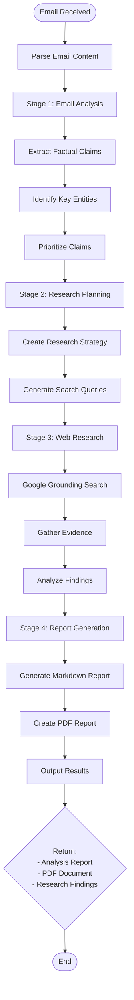

# Email Analyst Agent Documentation

## Overview

The **Email Analyst Agent** performs comprehensive fact-checking and research analysis on email content. It uses a multi-agent architecture to extract factual claims, verify them against authoritative sources, and generate detailed reports.

---

## Architecture

```
┌─────────────────────────────────────────────────────────────────┐
│                 Email Analyst Plugin Agent                      │
├─────────────────────────────────────────────────────────────────┤
│                                                                 │
│  ┌─────────────────────────────────────────────────────────┐   │
│  │              Multi-Agent Analysis Pipeline              │   │
│  │                                                         │   │
│  │   Input: Email Content                                  │   │
│  │        │                                                │   │
│  │        ▼                                                │   │
│  │   ┌─────────────┐                                       │   │
│  │   │   Email     │───▶ Extracts factual claims          │   │
│  │   │  Analysis   │───▶ Identifies key entities          │   │
│  │   │    Agent    │───▶ Prioritizes claims               │   │
│  │   └──────┬──────┘                                       │   │
│  │          │                                              │   │
│  │          ▼                                              │   │
│  │   ┌─────────────┐                                       │   │
│  │   │   Research  │───▶ Creates research strategy        │   │
│  │   │   Planning  │───▶ Suggests search queries          │   │
│  │   │    Agent    │                                       │   │
│  │   └──────┬──────┘                                       │   │
│  │          │                                              │   │
│  │          ▼                                              │   │
│  │   ┌─────────────┐                                       │   │
│  │   │    Web      │───▶ Conducts web research            │   │
│  │   │   Research  │───▶ Google Grounding search          │   │
│  │   │    Agent    │───▶ Gathers evidence                 │   │
│  │   └──────┬──────┘                                       │   │
│  │          │                                              │   │
│  │          ▼                                              │   │
│  │   ┌─────────────┐                                       │   │
│  │   │   Report    │───▶ Generates markdown report        │   │
│  │   │  Generation │───▶ Creates PDF                      │   │
│  │   │    Agent    │                                       │   │
│  │   └─────────────┘                                       │   │
│  │                                                         │   │
│  └─────────────────────────────────────────────────────────┘   │
│                                                                 │
└─────────────────────────────────────────────────────────────────┘
```

---

## Flowchart



---

## Multi-Agent Architecture

### Agent 1: EmailAnalysisAgent
```python
class EmailAnalysisAgent:
    """
    Analyzes emails to extract factual claims that need verification.
    """
    
    async def analyze_email(
        self, 
        email_content: str, 
        user_query: str = ""
    ) -> Dict[str, Any]:
        """
        Extracts:
        - Summary of main points
        - List of factual claims
        - Key entities (people, orgs, locations, dates)
        - Priority levels (high/medium/low)
        - Suggested search terms
        """
```

**Output Format:**
```json
{
    "summary": "Brief email summary",
    "claims": [
        {
            "claim": "Statement to verify",
            "priority": "high/medium/low",
            "category": "financial/political/scientific"
        }
    ],
    "entities": {
        "people": ["Name1", "Name2"],
        "organizations": ["Org1", "Org2"],
        "locations": ["Location1"],
        "dates": ["2024-01-01"]
    },
    "search_terms": ["query1", "query2"]
}
```

### Agent 2: ResearchPlanningAgent
```python
class ResearchPlanningAgent:
    """
    Creates comprehensive research strategies based on email analysis.
    """
    
    async def create_research_plan(
        self, 
        email_analysis: Dict[str, Any]
    ) -> Dict[str, Any]:
        """
        Creates:
        - Overall research strategy
        - Specific search queries for each claim
        - Priority order for investigation
        - Source type recommendations
        - Conflict handling strategy
        """
```

**Output Format:**
```json
{
    "strategy": "Overall approach",
    "search_queries": ["query1", "query2", "query3"],
    "priorities": ["high", "medium", "low"],
    "source_types": ["news", "government", "academic"],
    "confidence_expectations": "Expected accuracy levels"
}
```

### Agent 3: WebResearchAgent
```python
class WebResearchAgent:
    """
    Conducts web research using Google Grounding with Search.
    """
    
    async def conduct_research(
        self, 
        research_plan: Dict[str, Any]
    ) -> Dict[str, Any]:
        """
        Executes:
        - Parallel Google Grounding searches
        - Evidence gathering from authoritative sources
        - Real-time web verification
        - Source credibility evaluation
        """
```

**Features:**
- Parallel execution of multiple queries
- Google Grounding integration for real-time search
- Citation extraction from grounding metadata
- Source quality evaluation

### Agent 4: ReportGenerationAgent
```python
class ReportGenerationAgent:
    """
    Generates comprehensive fact-checking reports.
    """
    
    async def generate_report(
        self,
        email_content: str,
        email_analysis: Dict[str, Any],
        research_plan: Dict[str, Any],
        research_results: Dict[str, Any]
    ) -> str:
        """
        Creates professional markdown report with:
        - Executive summary
        - Original claims
        - Investigation methodology
        - Detailed findings per claim
        - Overall conclusions
        - Source citations
        """
```

---

## Main Orchestrator

```python
class MultiAgentEmailAnalyzer:
    """
    Main orchestrator coordinating all 4 agents.
    """
    
    async def analyze_and_report(
        self,
        email_content: str,
        user_query: str = "",
        generate_pdf: bool = True
    ) -> Dict[str, Any]:
        """
        Orchestrates the complete pipeline:
        1. Email Analysis (Agent 1)
        2. Research Planning (Agent 2)
        3. Web Research (Agent 3)
        4. Report Generation (Agent 4)
        5. PDF Generation (optional)
        
        Returns structured results with all stages.
        """
```

---

## Tools

### 1. `analyze_email_content`
```python
@tool
async def analyze_email_content(
    email_content: str,
    user_query: str = ""
) -> str:
    """
    Analyze email content for factual claims and generate a report.
    
    Args:
        email_content: Full email text including headers
        user_query: Specific questions about the email
    
    Returns:
        Comprehensive fact-checking report
    """
```

---

## Report Structure

### Generated Report Format

```markdown
# Fact-Checking Report

## Executive Summary
Brief overview of findings and overall verdict.

## Original Claims
List of claims extracted from the email:
1. **Claim 1**: [Text] - Priority: High
2. **Claim 2**: [Text] - Priority: Medium
3. **Claim 3**: [Text] - Priority: Low

## Investigation Methodology
- Analysis approach
- Search strategy
- Sources consulted
- Confidence levels

## Detailed Findings

### Claim 1: [Claim Text]
**Status**: ✅ Verified / ❌ False / ⚠️ Partially True / ❓ Unverifiable

**Evidence For:**
- Source 1: [Citation]
- Source 2: [Citation]

**Evidence Against:**
- Source 3: [Citation]

**Analysis:**
Detailed explanation of verification process and findings.

### Claim 2: [Claim Text]
...

## Conclusion
Overall assessment of email accuracy and trustworthiness.

## Sources
1. [Source Title](URL) - Retrieved: [Date]
2. [Source Title](URL) - Retrieved: [Date]
```

---

## Usage Example

```python
from server.agents import create_default_registry, AgentContext

# Initialize
registry = create_default_registry()
agent = registry.get("email_analyst")

# Sample suspicious email
email_content = """
From: lottery@winner.com
Subject: URGENT: You've Won $1,000,000!

Dear Winner,

You have been selected to receive $1,000,000 USD!
Bill Gates personally selected you for this prize.
Send us your bank details to claim.
"""

# Analyze
context = AgentContext(
    user_id="user_123",
    session_id="email_analysis_001",
    metadata={"email_content": email_content}
)

response = await agent.handle(
    "Is this email legitimate? Check the claims.",
    context
)

# Results
print(response.message)  # Full report
print(response.data["pdf_path"])  # Path to PDF report
print(response.data["stages"])  # All pipeline stages
```

---

## Pipeline Stages

```
┌────────────────────────────────────────────────────────────────┐
│                    ANALYSIS PIPELINE                           │
├────────────────────────────────────────────────────────────────┤
│                                                                │
│  Stage 1: ANALYZING_EMAIL                                      │
│  ├── Extract claims                                            │
│  ├── Identify entities                                         │
│  └── Output: email_analysis dict                               │
│                                                                │
│  Stage 2: PLANNING_RESEARCH                                    │
│  ├── Create strategy                                           │
│  ├── Generate queries                                          │
│  └── Output: research_plan dict                                │
│                                                                │
│  Stage 3: CONDUCTING_RESEARCH                                  │
│  ├── Execute searches                                          │
│  ├── Gather evidence                                           │
│  └── Output: research_results dict                             │
│                                                                │
│  Stage 4: GENERATING_REPORT                                    │
│  ├── Create markdown                                           │
│  └── Output: final_report string                               │
│                                                                │
│  Stage 5: GENERATING_PDF (optional)                            │
│  ├── Convert to PDF                                            │
│  └── Output: pdf_path string                                   │
│                                                                │
│  Stage 6: COMPLETED                                            │
│  └── Return all results                                        │
│                                                                │
└────────────────────────────────────────────────────────────────┘
```

---

## Configuration

### Environment Variables
```bash
# Required
GOOGLE_API_KEY=your_google_api_key

# Optional (for web search)
SERPER_API_KEY=your_serper_api_key
```

### Agent Configuration
```python
# LLM Configuration
model = "gemini-2.0-flash"
temperature = 0.2  # Low for factual accuracy

# Processing Limits
max_search_queries = 3  # Limit for performance
max_claims = 10  # Maximum claims to analyze
```

---

## Claim Categories

The agent focuses on verifying claims about:

| Category | Examples | Priority |
|----------|----------|----------|
| **Political** | Elections, policy, achievements | High |
| **Business** | Financial performance, acquisitions | High |
| **Scientific** | Medical claims, research results | High |
| **Financial** | Investment returns, guarantees | High |
| **Historical** | Events, statistics | Medium |
| **Personal** | Achievements, qualifications | Medium |

---

## Error Handling

| Scenario | Response | Action |
|----------|----------|--------|
| No claims found | "No verifiable claims detected" | Return summary only |
| API unavailable | Use fallback logic | Continue with limited analysis |
| PDF generation fails | Return markdown only | Report PDF error |
| Search fails | Mark claims as unverifiable | Include in report |

---

## Integration Points

- **PDF Agent**: Generates final PDF report
- **Research Agent**: Uses web search tools
- **Composio**: Can fetch email content from Gmail

---

## Performance Considerations

- **Parallel Processing**: Web searches run in parallel
- **Caching**: Session-based caching for repeated queries
- **Limits**: Max 3 search queries for efficiency
- **Timeouts**: 30s timeout for web requests

---

## Testing

```bash
# Test email analysis
uv run python -c "
from server.agents.email_analyst import EmailAnalystPluginAgent
agent = EmailAnalystPluginAgent()
print(f'Agent: {agent.name}')
print(f'Tools: {len(agent.get_tools())}')
print(f'Multi-Agent Pipeline: 4 agents')
"
```

---

## Files Structure

```
gmail-agent/server/agents/email_analyst/
├── __init__.py          # Exports EmailAnalystPluginAgent
├── agent.py             # Main agent class
├── logic.py             # 4 sub-agents and orchestrator
└── tools.py             # analyze_email_content tool
```

---

## Summary

The Email Analyst Agent provides comprehensive fact-checking:

- ✅ **Multi-agent architecture** for specialized tasks
- ✅ **Google Grounding** for real-time web search
- ✅ **4-stage pipeline** from analysis to report
- ✅ **Professional reports** with citations
- ✅ **PDF generation** for documentation
- ✅ **Entity extraction** and prioritization

**Use Case**: Perfect for verifying suspicious emails, checking business claims, or validating information before making decisions.
