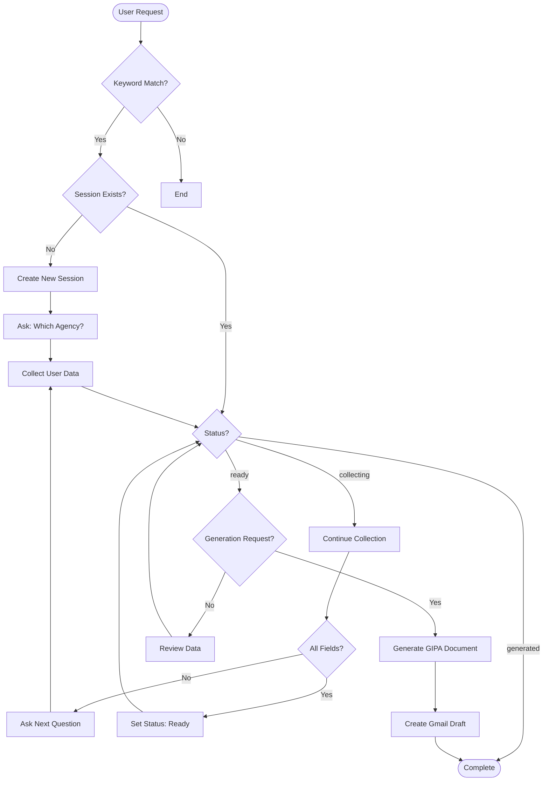

# GIPA Agent Documentation

## Overview

The **GIPA (Government Information Public Access) Agent** handles Freedom of Information (FOI) requests for NSW Government agencies under the GIPA Act. It provides an interactive, multi-turn conversation flow to collect all necessary information before generating a formal document.

---

## Architecture

```
┌─────────────────────────────────────────────────────────────────┐
│                     GIPA Plugin Agent                           │
├─────────────────────────────────────────────────────────────────┤
│                                                                 │
│  ┌──────────────┐    ┌──────────────┐    ┌──────────────┐      │
│  │   Keywords   │    │   Session    │    │    Tools     │      │
│  │   Matching   │───▶│   Manager    │───▶│   Router     │      │
│  └──────────────┘    └──────────────┘    └──────────────┘      │
│         │                   │                   │               │
│         ▼                   ▼                   ▼               │
│  ┌─────────────────────────────────────────────────────────┐   │
│  │                    GIPA Request Agent                   │   │
│  │  ┌──────────┐  ┌──────────┐  ┌──────────┐  ┌────────┐  │   │
│  │  │  Start   │─▶│ Collect  │─▶│  Review  │─▶│ Generate│  │   │
│  │  │  Request │  │   Data   │  │   Data   │  │Document│  │   │
│  │  └──────────┘  └──────────┘  └──────────┘  └────────┘  │   │
│  └─────────────────────────────────────────────────────────┘   │
│                                                                 │
└─────────────────────────────────────────────────────────────────┘
```

---

## Flowchart



---

## Agent Structure

```python
class GIPAPluginAgent(BaseAgent):
    """
    GIPA Agent for handling Government Information requests
    """
    
    # Configuration
    name = "gipa"
    description = "Government Information Public Access (GIPA/FOI) request handler"
    keywords = ["gipa", "foi", "freedom of information", ...]
    active_statuses = ["collecting", "ready", "generated"]
    
    # Session Management
    async def get_status(self, session_id) -> str
        # Returns: "none", "collecting", "ready", "generated"
    
    # Main Handler
    async def handle(self, message: str, context: AgentContext) -> AgentResponse
        # Routes to appropriate handler based on status
```

---

## Data Collection Flow

### Required Fields

| Field | Description | Question Asked |
|-------|-------------|----------------|
| `agency_name` | NSW Government agency name | "Which government agency are you requesting information from?" |
| `agency_email` | Contact email for the agency | "What is the agency's email address?" |
| `applicant_name` | Requester's full name | "What is your full name?" |
| `applicant_address` | Requester's postal address | "What is your postal address?" |
| `information_sought` | Description of information requested | "What information are you seeking? Please describe in detail." |
| `preferred_format` | Preferred format (email/physical) | "How would you like to receive the information?" |

### Session States

```
┌─────────────┐     ┌─────────────┐     ┌─────────────┐     ┌─────────────┐
│    none     │────▶│ collecting  │────▶│    ready    │────▶│  generated  │
└─────────────┘     └─────────────┘     └─────────────┘     └─────────────┘
      │                    │                   │                   │
      │                    │                   │                   │
      ▼                    ▼                   ▼                   ▼
  New request       Collecting info      All fields         Document
                                           filled            created
```

---

## Tools

### 1. `gipa_start_request`
```python
@tool
def gipa_start_request(session_id: str) -> str:
    """
    Start a new GIPA request session.
    Initializes the session and asks the first question.
    """
```

### 2. `gipa_process_answer`
```python
@tool
def gipa_process_answer(session_id: str, answer: str) -> str:
    """
    Process user answer and determine next question.
    Stores data and returns next question or confirmation.
    """
```

### 3. `gipa_generate_document`
```python
@tool
def gipa_generate_document(session_id: str) -> str:
    """
    Generate formal GIPA request document.
    Creates HTML document and Gmail draft.
    """
```

### 4. `gipa_check_status`
```python
@tool
def gipa_check_status(session_id: str) -> dict:
    """
    Check current session status and collected data.
    Returns status, progress, and missing fields.
    """
```

---

## Usage Example

```python
from server.agents import create_default_registry, AgentContext

# Initialize registry
registry = create_default_registry()
agent = registry.get("gipa")

# Start conversation
context = AgentContext(
    user_id="user_123",
    session_id="gipa_session_001"
)

# Step 1: User initiates request
response1 = await agent.handle("I want to file a GIPA request", context)
# Response: "Which government agency are you requesting information from?"

# Step 2: User provides agency
response2 = await agent.handle("Transport for NSW", context)
# Response: "What is your full name?"

# Step 3: Continue providing information...

# Step 4: When all fields collected
response_n = await agent.handle("Yes, please generate the document", context)
# Response: "✅ Dokumen GIPA berhasil dibuat dan draft email sudah tersimpan!"
```

---

## Document Template

The generated document follows NSW Government GIPA Act requirements:

```html
<!DOCTYPE html>
<html>
<head>
    <title>GIPA Request - [Applicant Name]</title>
    <style>
        /* Professional NSW Government styling */
    </style>
</head>
<body>
    <h1>Formal Access Application</h1>
    <p><strong>To:</strong> [Agency Name]</p>
    <p><strong>From:</strong> [Applicant Name]</p>
    <p><strong>Address:</strong> [Applicant Address]</p>
    
    <h2>Information Sought</h2>
    <p>[Detailed description]</p>
    
    <h2>Preferred Format</h2>
    <p>[Email/Physical]</p>
    
    <p>... [Legal GIPA Act clauses] ...</p>
</body>
</html>
```

---

## Configuration

### Environment Variables
```bash
# Required for Gmail draft creation
COMPOSIO_API_KEY=your_composio_api_key

# Optional for enhanced features
GOOGLE_API_KEY=your_google_api_key
```

### Agent Configuration
```python
# GIPA Generation Keywords (trigger document generation)
GENERATE_KEYWORDS = [
    "generate", "generat", "buat", "siapkan", "buatkan",
    "iya", "ya", "yes", "benar", "betul", "ok", "oke",
    "confirm", "konfirmasi", "sudah", "done", "complete", "selesai",
]
```

---

## Error Handling

| Error Scenario | Response | Action |
|----------------|----------|--------|
| Missing agency | "Please provide the agency name" | Ask again |
| Invalid email | "Please provide a valid email" | Validate and retry |
| Session expired | "Session expired, starting new request" | Create new session |
| Generation failed | "❌ Error: [error message]" | Return error details |

---

## Integration Points

- **Gmail Agent**: Creates email draft after document generation
- **Composio**: Used for Gmail integration (create_draft action)
- **Session Storage**: In-memory dictionary (_gipa_sessions)

---

## Testing

```bash
# Run GIPA agent test
uv run python -c "
from server.agents.gipa import GIPAPluginAgent
agent = GIPAPluginAgent()
print(f'Agent: {agent.name}')
print(f'Tools: {len(agent.get_tools())}')
print(f'Keywords: {agent.keywords}')
"
```

---

## Files Structure

```
gmail-agent/server/agents/gipa/
├── __init__.py          # Exports GIPAPluginAgent and tools
├── agent.py             # Main agent class and routing logic
├── logic.py             # GIPARequestAgent and session management
└── tools.py             # 4 LangChain tools for GIPA operations
```

---

## Summary

The GIPA Agent provides a complete solution for filing Government Information Public Access requests in NSW:

- ✅ **Multi-turn conversation** collects all required fields
- ✅ **Session management** maintains state across messages
- ✅ **Document generation** creates professional HTML documents
- ✅ **Gmail integration** automatically creates email drafts
- ✅ **Progressive disclosure** asks one question at a time
- ✅ **Confirmation flow** ensures accuracy before generation

**Use Case**: Ideal for users who need to request government information under the GIPA Act with a guided, step-by-step process.
