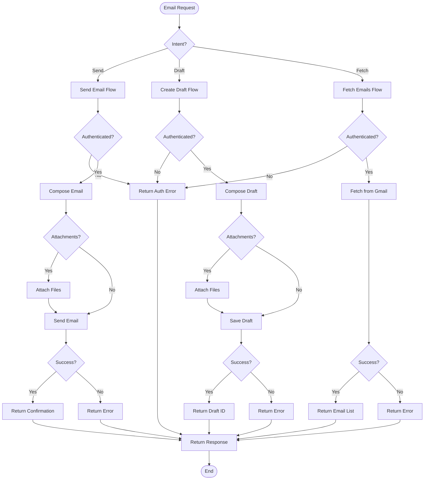

# Gmail Agent Documentation

## Overview

The **Gmail Agent** manages Gmail operations including sending emails, creating drafts, and fetching messages. It provides a complete email management interface through the Composio integration.

---

## Architecture

```
┌─────────────────────────────────────────────────────────────────┐
│                     Gmail Plugin Agent                          │
├─────────────────────────────────────────────────────────────────┤
│                                                                 │
│  ┌─────────────────────────────────────────────────────────┐   │
│  │                  Gmail Operations                       │   │
│  │                                                         │   │
│  │   ┌──────────────┐  ┌──────────────┐  ┌──────────────┐ │   │
│  │   │    Send      │  │    Draft     │  │    Fetch     │ │   │
│  │   │    Email     │  │   Creation   │  │   Emails     │ │   │
│  │   │              │  │              │  │              │ │   │
│  │   │ - Compose    │  │ - Compose    │  │ - Read       │ │   │
│  │   │ - Attach     │  │ - Save       │  │ - Search     │ │   │
│  │   │ - Send       │  │ - Drafts     │  │ - Filter     │ │   │
│  │   └──────┬───────┘  └──────┬───────┘  └──────┬───────┘ │   │
│  │          │                 │                 │         │   │
│  │          └────────┬────────┴────────┬────────┘         │   │
│  │                   │                 │                  │   │
│  │                   ▼                 ▼                  │   │
│  │   ┌─────────────────────────────────────────────┐     │   │
│  │   │            Composio Integration             │     │   │
│  │   │                                             │     │   │
│  │   │  - Gmail API Authentication               │     │   │
│  │   │  - OAuth Token Management                 │     │   │
│  │   │  - Rate Limiting                          │     │   │
│  │   │  - Error Handling                         │     │   │
│  │   └─────────────────────────────────────────────┘     │   │
│  │                                                         │   │
│  └─────────────────────────────────────────────────────────┘   │
│                                                                 │
└─────────────────────────────────────────────────────────────────┘
```

---

## Flowchart



---

## Agent Structure

```python
class GmailPluginAgent(BaseAgent):
    """
    Gmail Agent for email management
    """
    
    # Configuration
    name = "gmail"
    description = "Sends emails, creates drafts, and fetches messages from Gmail"
    keywords = [
        "email", "gmail", "kirim email", "pesan",
        "inbox", "surat", "draft", "send"
    ]
    
    async def get_status(self, session_id) -> str
        # Stateless - always returns "none"
    
    async def handle(self, message: str, context: AgentContext) -> AgentResponse
        # Routes to send, draft, or fetch based on intent
```

---

## Tools

### 1. `gmail_send_email`
```python
@tool
async def gmail_send_email(
    recipient_email: str,
    subject: str,
    body: str,
    attachment: str = ""
) -> str:
    """
    Send an email using Gmail.
    
    Args:
        recipient_email: To address
        subject: Email subject
        body: Email body (HTML or plain text)
        attachment: Optional file path to attach
    
    Returns:
        Success message or error
    """
```

**Features:**
- Send to any email address
- HTML or plain text body
- File attachments
- Delivery confirmation

### 2. `gmail_create_draft`
```python
@tool
async def gmail_create_draft(
    recipient_email: str,
    subject: str,
    body: str,
    attachment: str = ""
) -> str:
    """
    Create a draft email in Gmail.
    
    Args:
        recipient_email: To address
        subject: Email subject
        body: Email body
        attachment: Optional file path to attach
    
    Returns:
        Draft creation confirmation
    """
```

**Features:**
- Save as draft (not sent)
- Edit later in Gmail
- Review before sending
- Attachment support

### 3. `gmail_fetch_emails`
```python
@tool
async def gmail_fetch_emails(
    query: str = "",
    max_results: int = 10
) -> str:
    """
    Fetch emails from Gmail inbox.
    
    Args:
        query: Gmail search query (e.g., "from:boss@company.com")
        max_results: Maximum emails to fetch (default: 10)
    
    Returns:
        List of emails with subject, sender, snippet
    """
```

**Features:**
- Gmail search syntax
- Filter by sender, date, label
- Preview snippets
- Configurable limit

---

## Operations

### 1. Send Email
```python
# Send email to recipient
result = await gmail_send_email(
    recipient_email="boss@company.com",
    subject="Q4 Report",
    body="<h1>Quarterly Report</h1><p>Please find...</p>",
    attachment="/path/to/report.pdf"
)
```

### 2. Create Draft
```python
# Create draft for later editing
result = await gmail_create_draft(
    recipient_email="team@company.com",
    subject="Meeting Tomorrow",
    body="Hi team,\n\nMeeting at 10am...",
    attachment=""
)
```

### 3. Fetch Emails
```python
# Fetch recent emails
emails = await gmail_fetch_emails(
    query="from:client@example.com newer_than:2d",
    max_results=5
)
```

---

## Usage Examples

### Example 1: Send Email
```python
from server.agents import create_default_registry, AgentContext

registry = create_default_registry()
agent = registry.get("gmail")

# Send email
context = AgentContext(
    user_id="user_123",
    session_id="gmail_001",
    metadata={
        "recipient": "boss@company.com",
        "subject": "Project Update",
        "body": "<h1>Weekly Update</h1><p>Progress...</p>"
    }
)

response = await agent.handle(
    "Send email to boss about project update",
    context
)

# Response: "✅ Email sent successfully to boss@company.com"
```

### Example 2: Create Draft
```python
# Create draft
response = await agent.handle(
    "Create draft email to team about tomorrow's meeting",
    context
)

# Response: "✅ Draft created and saved to Gmail"
```

### Example 3: Fetch Recent Emails
```python
# Fetch emails
context.metadata = {
    "query": "from:investor@vc.com",
    "max_results": 5
}

response = await agent.handle(
    "Fetch recent emails from investors",
    context
)

# Returns list of matching emails
```

---

## Configuration

### Environment Variables
```bash
# Required for Composio
COMPOSIO_API_KEY=your_composio_api_key

# Optional Gmail OAuth
GMAIL_CLIENT_ID=your_client_id
GMAIL_CLIENT_SECRET=your_client_secret
```

### Composio Setup
```python
# Gmail App Configuration
APP_NAME = "GMAIL"
AUTH_SCHEME = "OAUTH2"
SCOPES = [
    "https://www.googleapis.com/auth/gmail.send",
    "https://www.googleapis.com/auth/gmail.compose",
    "https://www.googleapis.com/auth/gmail.readonly"
]
```

### Authentication Flow
```python
# 1. Check if connected
connected = check_gmail_connected(composio_client, user_id)

# 2. If not connected, initiate OAuth
if not connected:
    connection = connect_gmail(composio_client, user_id)
    # Returns: {redirect_url: "https://..."}

# 3. User completes OAuth on browser
# 4. Connection established
```

---

## Response Formats

### Send Email Success
```
✅ Email sent successfully!

To: boss@company.com
Subject: Project Update
Sent at: 2024-01-15 14:30:00 UTC
Message ID: <1234567890@mail.gmail.com>
```

### Draft Creation Success
```
✅ Draft created successfully!

To: team@company.com
Subject: Meeting Tomorrow
Draft ID: r-1234567890
Saved at: 2024-01-15 14:30:00 UTC

You can edit this draft in your Gmail.
```

### Fetch Emails Success
```
📧 Found 3 emails:

1. From: investor@vc.com
   Subject: Investment Opportunity
   Date: Jan 15, 2024
   Snippet: "We are interested in investing..."

2. From: investor@vc.com
   Subject: Follow-up
   Date: Jan 14, 2024
   Snippet: "Following up on our previous..."

3. From: investor@vc.com
   Subject: Introduction
   Date: Jan 13, 2024
   Snippet: "I'd like to introduce..."
```

---

## Search Query Syntax

Gmail search supports standard Gmail operators:

| Operator | Description | Example |
|----------|-------------|---------|
| `from:` | From specific sender | `from:boss@company.com` |
| `to:` | To specific recipient | `to:team@company.com` |
| `subject:` | Subject contains | `subject:meeting` |
| `has:attachment` | Has attachments | `has:attachment` |
| `newer_than:` | Date range | `newer_than:2d` |
| `older_than:` | Date range | `older_than:1w` |
| `label:` | Specific label | `label:important` |
| `is:unread` | Unread emails | `is:unread` |
| `is:starred` | Starred emails | `is:starred` |

---

## Error Handling

| Error | Cause | Solution |
|-------|-------|----------|
| Not authenticated | Gmail not connected | Use connect_gmail() |
| Invalid email | Bad email format | Validate address |
| Attachment too large | > 25MB | Use Google Drive link |
| Rate limit | Too many emails | Wait and retry |
| Permission denied | Missing scopes | Re-authenticate |

---

## Integration Points

- **Composio**: Gmail API integration
- **Auth Module**: Connection management
- **GIPA Agent**: Creates email drafts for GIPA documents
- **PDF Agent**: Can attach PDF reports to emails
- **Dossier Agent**: Can email dossiers

---

## Testing

```bash
# Test Gmail agent
uv run python -c "
from server.agents.gmail import GmailPluginAgent
from server.agents.gmail.tools import get_gmail_tools

agent = GmailPluginAgent()
tools = get_gmail_tools()

print(f'Agent: {agent.name}')
print(f'Operations: Send, Draft, Fetch')
print(f'Tools: {len(tools)}')
for tool in tools:
    print(f'  - {tool.name}')
"
```

---

## Files Structure

```
gmail-agent/server/agents/gmail/
├── __init__.py          # Exports GmailPluginAgent
├── agent.py             # Main agent class
├── logic.py             # Gmail operations
└── tools.py             # 3 LangChain tools
```

---

## Summary

The Gmail Agent provides complete email management:

- ✅ **Send emails** with attachments
- ✅ **Create drafts** for later editing
- ✅ **Fetch emails** with Gmail search
- ✅ **HTML support** for rich formatting
- ✅ **OAuth integration** via Composio
- ✅ **Gmail search** syntax support
- ✅ **Delivery confirmation**

**Use Case**: Perfect for sending reports, creating drafts, managing inbox, and integrating email functionality with other agents.
