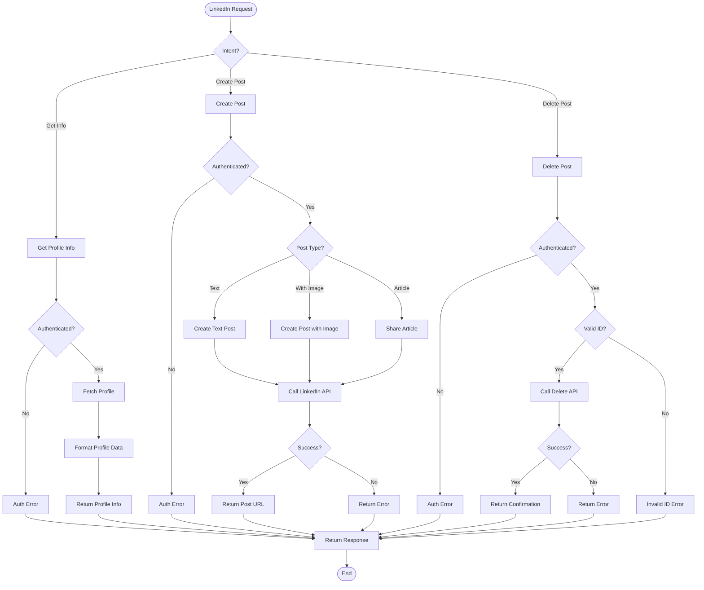

# LinkedIn Agent Documentation

## Overview

The **LinkedIn Agent** manages LinkedIn profile information and posting capabilities. It integrates with Composio for LinkedIn API access, allowing users to fetch profile information, create posts, and manage their professional presence.

---

## Architecture

```
┌─────────────────────────────────────────────────────────────────┐
│                    LinkedIn Plugin Agent                        │
├─────────────────────────────────────────────────────────────────┤
│                                                                 │
│  ┌─────────────────────────────────────────────────────────┐   │
│  │                  LinkedIn Operations                    │   │
│  │                                                         │   │
│  │   ┌──────────────┐  ┌──────────────┐  ┌──────────────┐ │   │
│  │   │  Get Profile │  │ Create Post  │  │ Delete Post  │ │   │
│  │   │   Info       │  │              │  │              │ │   │
│  │   │              │  │              │  │              │ │   │
│  │   │ - Profile    │  │ - Text       │  │ - Post ID    │ │   │
│  │   │   details    │  │ - Images     │  │ - Remove     │ │   │
│  │   │ - Headline   │  │ - Articles   │  │   post       │ │   │
│  │   │ - Experience │  │ - Links      │  │              │ │   │
│  │   └──────┬───────┘  └──────┬───────┘  └──────┬───────┘ │   │
│  │          │                 │                 │         │   │
│  │          └────────┬────────┴────────┬────────┘         │   │
│  │                   │                 │                  │   │
│  │                   ▼                 ▼                  │   │
│  │   ┌─────────────────────────────────────────────┐     │   │
│  │   │            Composio Integration             │     │   │
│  │   │                                             │     │   │
│  │   │  - LinkedIn API Authentication            │     │   │
│  │   │  - OAuth 2.0 Flow                         │     │   │
│  │   │  - Rate Limiting                          │     │   │
│  │   │  - Profile Data Fetching                  │     │   │
│  │   │  - Post Publishing                        │     │   │
│  │   └─────────────────────────────────────────────┘     │   │
│  │                                                         │   │
│  └─────────────────────────────────────────────────────────┘   │
│                                                                 │
└─────────────────────────────────────────────────────────────────┘
```

---

## Flowchart



---

## Agent Structure

```python
class LinkedInPluginAgent(BaseAgent):
    """
    LinkedIn Agent for professional networking
    """
    
    # Configuration
    name = "linkedin"
    description = "Manages LinkedIn profiles, fetches info, and creates posts"
    keywords = [
        "linkedin", "linked in", "professional",
        "post linkedin", "kerja", "profil linkedin"
    ]
    
    async def get_status(self, session_id) -> str
        # Stateless - always returns "none"
    
    async def handle(self, message: str, context: AgentContext) -> AgentResponse
        # Routes to profile fetch or post creation
```

---

## Tools

### 1. `linkedin_get_info`
```python
@tool
async def linkedin_get_info() -> str:
    """
    Get LinkedIn profile information.
    
    Returns:
        Profile details including name, headline, experience, education
    """
```

**Features:**
- Profile name and headline
- Current position
- Company information
- Profile URL
- Connection count

### 2. `linkedin_post`
```python
@tool
async def linkedin_post(
    text: str,
    image_path: str = "",
    article_url: str = ""
) -> str:
    """
    Create a LinkedIn post.
    
    Args:
        text: Post content
        image_path: Optional image to attach
        article_url: Optional article URL to share
    
    Returns:
        Success message with post URL or error
    """
```

**Features:**
- Text posts
- Image attachments
- Article sharing
- URL in response

### 3. `linkedin_delete_post`
```python
@tool
async def linkedin_delete_post(post_id: str) -> str:
    """
    Delete a LinkedIn post.
    
    Args:
        post_id: ID of the post to delete
    
    Returns:
        Success confirmation or error
    """
```

**Features:**
- Delete by post ID
- Confirmation response
- Error handling

---

## Usage Examples

### Example 1: Get Profile Information
```python
from server.agents import create_default_registry, AgentContext

registry = create_default_registry()
agent = registry.get("linkedin")

# Get profile info
context = AgentContext(
    user_id="user_123",
    session_id="linkedin_001"
)

response = await agent.handle(
    "Get my LinkedIn profile information",
    context
)

# Response includes profile details
```

### Example 2: Create LinkedIn Post
```python
# Create a professional post
response = await agent.handle(
    "Create LinkedIn post: Excited to share that I've joined ABC Company as Senior Developer!",
    context
)

# Response: "✅ Posted to LinkedIn: https://linkedin.com/posts/..."
```

### Example 3: Share Article
```python
from server.agents.linkedin.tools import linkedin_post

# Share article with comment
result = await linkedin_post(
    text="Great insights on AI trends in 2024",
    article_url="https://example.com/ai-trends-2024"
)
```

### Example 4: Post with Image
```python
# Post with image attachment
result = await linkedin_post(
    text="Our team at the annual conference! 🎉",
    image_path="/path/to/conference_photo.jpg"
)
```

---

## Configuration

### Environment Variables
```bash
# Required for Composio
COMPOSIO_API_KEY=your_composio_api_key

# LinkedIn OAuth (handled by Composio)
# No direct API keys needed
```

### Composio Setup
```python
# LinkedIn App Configuration
APP_NAME = "LINKEDIN"
AUTH_SCHEME = "OAUTH2"
SCOPES = [
    "r_liteprofile",      # Basic profile info
    "r_basicprofile",     # Full profile info
    "w_member_social"     # Post creation
]
```

### Authentication Flow
```python
# 1. Check if connected
connected = check_linkedin_connected(composio_client, user_id)

# 2. If not connected, initiate OAuth
if not connected:
    connection = connect_linkedin(composio_client, user_id)
    # Returns: {redirect_url: "https://..."}

# 3. User completes OAuth in browser
# 4. Connection established
```

---

## Profile Data Format

```json
{
    "first_name": "John",
    "last_name": "Doe",
    "headline": "Senior Software Engineer at TechCorp",
    "current_position": {
        "title": "Senior Software Engineer",
        "company": "TechCorp",
        "start_date": "2023-01"
    },
    "profile_url": "https://linkedin.com/in/johndoe",
    "connections": 500
}
```

---

## Response Formats

### Get Profile Info Success
```
👤 LinkedIn Profile

Name: John Doe
Headline: Senior Software Engineer at TechCorp
Current Position: Senior Software Engineer at TechCorp
Profile URL: https://linkedin.com/in/johndoe
Connections: 500+
```

### Create Post Success
```
✅ Successfully posted to LinkedIn!

Post: "Excited to share that I've joined ABC Company as Senior Developer!"
URL: https://linkedin.com/posts/johndoe-123456
Posted at: 2024-01-15 14:30:00 UTC
```

### Delete Post Success
```
✅ Post deleted successfully!

Post ID: 123456789
Deleted at: 2024-01-15 14:35:00 UTC
```

### Error Response
```
❌ Failed to post to LinkedIn

Error: Authentication required
Please connect your LinkedIn account first.
Connection URL: https://composio.io/connect/linkedin
```

---

## Post Content Guidelines

### Best Practices
- **Professional tone**: Keep content professional
- **Hashtags**: Use 3-5 relevant hashtags
- **Length**: Optimal 150-200 characters for text posts
- **Images**: High-quality images perform better
- **Links**: LinkedIn favors native content over external links

### Content Types
| Type | Description | Best For |
|------|-------------|----------|
| **Text** | Plain text updates | Quick thoughts, announcements |
| **Image** | Photos, graphics | Visual content, events |
| **Article** | External link sharing | Blog posts, news |
| **Video** | Video content | Tutorials, presentations |

---

## Error Handling

| Error | Cause | Solution |
|-------|-------|----------|
| Not authenticated | LinkedIn not connected | Use connect_linkedin() |
| Rate limited | Too many posts | Wait and retry |
| Content rejected | Violates guidelines | Review content |
| Image too large | > 8MB | Compress image |
| Invalid post ID | Post doesn't exist | Check ID |
| API error | LinkedIn API failure | Retry later |

---

## Integration Points

- **Composio**: LinkedIn API integration
- **Auth Module**: Connection management
- **Quote Agent**: Can post quote images
- **Strategy Agent**: Can share strategic insights

---

## Testing

```bash
# Test LinkedIn agent
uv run python -c "
from server.agents.linkedin import LinkedInPluginAgent
from server.agents.linkedin.tools import get_linkedin_tools

agent = LinkedInPluginAgent()
tools = get_linkedin_tools()

print(f'Agent: {agent.name}')
print(f'Operations: Profile, Post, Delete')
print(f'Tools: {len(tools)}')
for tool in tools:
    print(f'  - {tool.name}')
"
```

---

## Files Structure

```
gmail-agent/server/agents/linkedin/
├── __init__.py          # Exports LinkedInPluginAgent
├── agent.py             # Main agent class
├── logic.py             # LinkedIn operations
└── tools.py             # 3 LangChain tools
```

---

## Summary

The LinkedIn Agent provides professional networking capabilities:

- ✅ **Profile fetching** with key information
- ✅ **Post creation** (text, images, articles)
- ✅ **Post deletion** by ID
- ✅ **OAuth integration** via Composio
- ✅ **Professional content** management
- ✅ **URL tracking** for all posts

**Use Case**: Perfect for professionals managing their LinkedIn presence, sharing career updates, posting industry insights, and maintaining professional branding.
