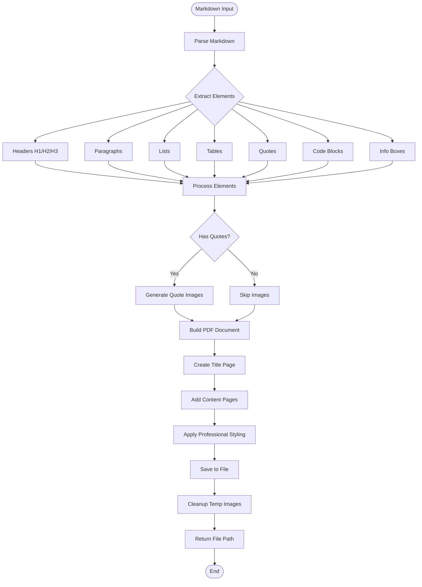

# PDF Agent Documentation

## Overview

The **PDF Agent** generates professional, styled PDF reports from Markdown content. It supports advanced formatting including headers, lists, tables, quotes, code blocks, and AI-generated quote images.

---

## Architecture

```
┌─────────────────────────────────────────────────────────────────┐
│                     PDF Plugin Agent                            │
├─────────────────────────────────────────────────────────────────┤
│                                                                 │
│  ┌─────────────────────────────────────────────────────────┐   │
│  │                  PDF Generation Pipeline                │   │
│  │                                                         │   │
│  │   Input: Markdown Content                               │   │
│  │        │                                                │   │
│  │        ▼                                                │   │
│  │   ┌─────────────┐                                       │   │
│  │   │   Parse     │───▶ Parse Markdown Structure         │   │
│  │   │  Markdown   │───▶ Extract Elements                 │   │
│  │   └──────┬──────┘                                       │   │
│  │          │                                              │   │
│  │          ▼                                              │   │
│  │   ┌─────────────┐                                       │   │
│  │   │   Generate  │───▶ Create Quote Images (optional)   │   │
│  │   │   Images    │                                       │   │
│  │   └──────┬──────┘                                       │   │
│  │          │                                              │   │
│  │          ▼                                              │   │
│  │   ┌─────────────┐                                       │   │
│  │   │    Build    │───▶ Create Title Page                │   │
│  │   │     PDF     │───▶ Add Content Pages                │   │
│  │   │             │───▶ Apply Styling                    │   │
│  │   └──────┬──────┘                                       │   │
│  │          │                                              │   │
│  │          ▼                                              │   │
│  │   ┌─────────────┐                                       │   │
│  │   │    Save     │──▶ Save to Attachment Folder         │   │
│  │   │    File     │                                       │   │
│  │   └─────────────┘                                       │   │
│  │                                                         │   │
│  └─────────────────────────────────────────────────────────┘   │
│                                                                 │
└─────────────────────────────────────────────────────────────────┘
```

---

## Flowchart



---

## Agent Structure

```python
class PDFPluginAgent(BaseAgent):
    """
    PDF Agent for professional report generation
    """
    
    # Configuration
    name = "pdf"
    description = "Generates professional PDF reports from Markdown content"
    keywords = ["pdf", "report", "document", "export pdf", "buat pdf"]
    
    async def get_status(self, session_id) -> str
        # Stateless - always returns "none"
    
    async def handle(self, message: str, context: AgentContext) -> AgentResponse
        # Extracts markdown from context and generates PDF
```

---

## Components

### 1. Markdown Parser
```python
def parse_markdown_content(content: str) -> List[Dict[str, Any]]:
    """
    Parses markdown into structured elements:
    - Headers (H1, H2, H3)
    - Paragraphs
    - Bullet lists
    - Numbered lists
    - Tables
    - Quotes
    - Code blocks
    - Info boxes
    - Horizontal rules
    """
```

**Supported Elements:**
| Element | Markdown Syntax | PDF Output |
|---------|----------------|------------|
| H1 | `# Title` | Large bold heading with underline |
| H2 | `## Section` | Medium bold heading |
| H3 | `### Subsection` | Small bold heading |
| Paragraph | Text | Justified text block |
| Bullet List | `- item` | Bullet points with indentation |
| Numbered List | `1. item` | Numbered items |
| Table | `|col1|col2|` | Styled table with headers |
| Quote | `> text` | Styled quote block with border |
| Code | ` ```code``` ` | Monospace block with background |
| Info Box | `[INFO] title` | Colored info/warning box |
| Horizontal Rule | `---` | Divider line |

### 2. ProfessionalPDF Class
```python
class ProfessionalPDF(FPDF, HTMLMixin):
    """
    Enhanced PDF class with professional styling.
    
    Features:
    - Custom header with logo
    - Footer with page numbers
    - Professional color scheme
    - Consistent typography
    - Decorative elements
    """
    
    # Color Palette
    primary_color = (0, 102, 204)      # Deep Blue
    secondary_color = (51, 51, 51)     # Dark Gray
    accent_color = (0, 153, 255)       # Bright Blue
    light_bg = (245, 248, 250)         # Light Blue-Gray
    border_color = (200, 210, 220)     # Border Gray
    
    # Methods
    def header(self)          # Top bar, logo, decorative line
    def footer(self)          # Page numbers, generation date
    def add_title_page(...)   # Cover page with metadata
    def add_heading1(...)     # H1 with underline
    def add_heading2(...)     # H2 style
    def add_heading3(...)     # H3 style
    def add_paragraph(...)    # Justified text
    def add_bullet_point(...) # Bullet with indent
    def add_numbered_item(...) # Numbered item
    def add_quote(...)        # Styled quote block
    def add_quote_with_image(...) # Quote with AI image
    def add_table_row(...)    # Table row (header/data)
    def add_info_box(...)     # Colored info/warning/success/error box
```

### 3. Quote Image Generator
```python
def generate_quote_image(
    quote_text: str,
    author: str,
    context: str = "",
    api_key: str = None
) -> Optional[str]:
    """
    Generates AI-powered quote visualizations using Gemini.
    
    Features:
    - Professional design
    - Indonesian national colors (red/white) or blue
    - Typography-focused layout
    - High-quality output for print
    """
```

---

## Tools

### 1. `generate_pdf_report_tool`
```python
@tool
async def generate_pdf_report_tool(
    markdown_content: str,
    filename: str = "report.pdf",
    sender_email: str = "AI Assistant",
    enable_quote_images: bool = True
) -> str:
    """
    Generate a professional PDF report from Markdown content.
    
    Args:
        markdown_content: Content in markdown format
        filename: Output filename (default: report_TIMESTAMP.pdf)
        sender_email: For logo generation (optional)
        enable_quote_images: Generate AI images for quotes
    
    Returns:
        Absolute path to generated PDF file
    """
```

---

## Document Templates

### Standard Report Template
```markdown
# Research Report: {title}

## Executive Summary
Brief overview of findings.

## Key Findings
- Finding 1
- Finding 2
- Finding 3

## Detailed Analysis
### Section 1
Content here...

### Section 2
Content here...

## Conclusion
Summary and recommendations.

## Sources
1. Source 1
2. Source 2
```

### Dossier Template
```markdown
# Meeting Prep Dossier: {person_name}

## Biographical Summary
Overview of background and experience.

## Professional History
### Experience
- Role at Company (Date-Date)
- Role at Company (Date-Date)

### Education
- Degree from University

## Strategic Insights
**Meeting Strategy:** Approach recommendation
**Negotiation Style:** Style analysis
**Recommended Approach:** Specific tactics

---
Confidential -- For internal use only
```

---

## Usage Example

```python
from server.agents import create_default_registry, AgentContext

# Initialize
registry = create_default_registry()
agent = registry.get("pdf")

# Markdown content
markdown = """
# Project Report: Q4 2024

## Executive Summary
Our Q4 performance exceeded expectations by 150%.

## Key Achievements
- Revenue growth: $10M
- New clients: 50+
- Team expansion: 20 people

## Quote from CEO
> "This quarter represents a turning point for our company."
> — CEO Name, Company Inc.

## Data Table
| Metric | Q3 | Q4 | Growth |
|--------|-----|-----|--------|
| Revenue | $5M | $10M | 100% |
| Clients | 100 | 150 | 50% |

## Conclusion
Strong finish to 2024 with momentum into 2025.
"""

# Generate PDF
context = AgentContext(
    user_id="user_123",
    session_id="pdf_001",
    metadata={"markdown_content": markdown}
)

response = await agent.handle(
    "Generate PDF report from this analysis",
    context
)

# Result
print(response.message)
# "✅ Laporan PDF berhasil dibuat: /path/to/report_20240115_143022.pdf"
```

---

## Styling System

### Color Scheme
```python
# Professional palette
COLORS = {
    'primary': (0, 102, 204),      # Headers, accents
    'secondary': (51, 51, 51),     # Body text
    'accent': (0, 153, 255),       # Underlines, highlights
    'light_bg': (245, 248, 250),   # Quote backgrounds
    'border': (200, 210, 220),     # Table borders, dividers
    'white': (255, 255, 255),      # Backgrounds
}
```

### Typography
```python
FONTS = {
    'title': ('helvetica', 'B', 26),      # H1
    'h1': ('helvetica', 'B', 18),         # H1
    'h2': ('helvetica', 'B', 14),         # H2
    'h3': ('helvetica', 'B', 12),         # H3
    'body': ('helvetica', '', 11),        # Paragraphs
    'quote': ('helvetica', 'I', 10),      # Quotes
    'code': ('courier', '', 9),           # Code blocks
    'footer': ('helvetica', '', 8),       # Page numbers
}
```

### Layout Specifications
- **Page Size**: A4 (210mm x 297mm)
- **Margins**: 10mm left/right, automatic top/bottom
- **Header Height**: 35mm with decorative bar
- **Footer Height**: 20mm with page numbers
- **Line Spacing**: 6mm for body text

---

## Configuration

### Environment Variables
```bash
# Required for quote images
GOOGLE_API_KEY=your_google_api_key

# Optional logo
# Place logo.png in server/tools/assets/
```

### PDF Options
```python
DEFAULT_OPTIONS = {
    'filename': 'report.pdf',
    'sender_email': 'AI Assistant',
    'enable_quote_images': True,
    'max_quote_images': 5,  # Limit for performance
}
```

---

## Special Features

### 1. Quote Image Integration
- Automatically detects quotes in markdown
- Generates AI images using Gemini
- Embeds images above quote text
- Cleans up temporary files after generation

### 2. Title Page Generation
- Professional cover page
- Context-aware subtitles
- Metadata section (date, classification)
- Dossier vs. report formatting

### 3. Unicode Handling
```python
# Automatic sanitization
unicode_replacements = {
    '\u2014': '--',    # em-dash
    '\u2018': "'",     # left single quote
    '\u2019': "'",     # right single quote
    '\u201c': '"',     # left double quote
    '\u201d': '"',     # right double quote
    '\u2026': '...',   # ellipsis
}
```

### 4. Table Support
- Auto-calculated column widths
- Header row styling
- Alternating row colors
- Border styling
- Multi-line cell support

---

## Error Handling

| Scenario | Response | Action |
|----------|----------|--------|
| No markdown content | "Error: No content provided" | Return error |
| Image generation fails | Continue without images | Log warning |
| Unicode error | Auto-sanitize | Replace characters |
| File save error | Return error path | Include traceback |

---

## Output Location

```
gmail-agent/
└── attacchment/           # PDF output folder
    ├── report_20240115_143022.pdf
    ├── dossier_john_doe_20240115_150045.pdf
    └── ...
```

---

## Testing

```bash
# Test PDF generation
uv run python -c "
from server.agents.pdf import PDFPluginAgent
agent = PDFPluginAgent()
print(f'Agent: {agent.name}')
print(f'Tools: {len(agent.get_tools())}')
print(f'Supports: Markdown parsing, quote images, tables')
"
```

---

## Files Structure

```
gmail-agent/server/agents/pdf/
├── __init__.py          # Exports PDFPluginAgent
├── agent.py             # Main agent class
├── generator.py         # ProfessionalPDF class and generation logic
├── logic.py             # Wrapper for async generation
└── tools.py             # generate_pdf_report_tool
```

---

## Summary

The PDF Agent provides professional document generation:

- ✅ **Markdown parsing** with full element support
- ✅ **Professional styling** with consistent branding
- ✅ **AI quote images** using Gemini (optional)
- ✅ **Table support** with auto-formatting
- ✅ **Info boxes** (info/warning/success/error)
- ✅ **Unicode handling** for international text
- ✅ **Title pages** with metadata
- ✅ **Automatic cleanup** of temporary files

**Use Case**: Perfect for generating research reports, meeting dossiers, analysis summaries, and any professional documentation from markdown content.
