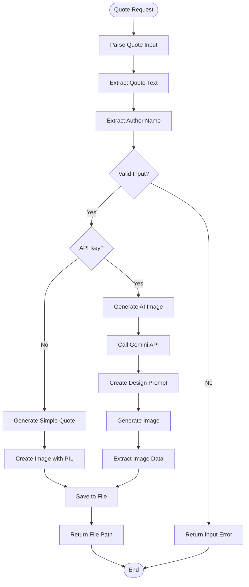

# Quote Agent Documentation

## Overview

The **Quote Agent** generates beautiful visual quote cards from text and author names. It creates professional quote images using AI (Gemini) with elegant typography and styling, perfect for social media sharing or presentations.

---

## Architecture

```
┌─────────────────────────────────────────────────────────────────┐
│                     Quote Plugin Agent                          │
├─────────────────────────────────────────────────────────────────┤
│                                                                 │
│  ┌─────────────────────────────────────────────────────────┐   │
│  │                Quote Generation Pipeline                │   │
│  │                                                         │   │
│  │   Input: Quote Text + Author                            │   │
│  │        │                                                │   │
│  │        ▼                                                │   │
│  │   ┌─────────────┐                                       │   │
│  │   │    Parse    │───▶ Extract quote and author         │   │
│  │   │    Input    │                                       │   │
│  │   └──────┬──────┘                                       │   │
│  │          │                                              │   │
│  │          ▼                                              │   │
│  │   ┌─────────────┐                                       │   │
│  │   │    AI       │───▶ Generate image with Gemini        │   │
│  │   │   Image     │───▶ Professional design              │   │
│  │   │ Generation  │───▶ Typography-focused               │   │
│  │   └──────┬──────┘                                       │   │
│  │          │                                              │   │
│  │          ▼                                              │   │
│  │   ┌─────────────┐                                       │   │
│  │   │    Save     │───▶ Store in attachment folder       │   │
│  │   │    Image    │                                       │   │
│  │   └──────┬──────┘                                       │   │
│  │          │                                              │   │
│  │          ▼                                              │   │
│  │   ┌─────────────┐                                       │   │
│  │   │   Return    │───▶ Return file path                 │   │
│  │   │    Path     │                                       │   │
│  │   └─────────────┘                                       │   │
│  │                                                         │   │
│  └─────────────────────────────────────────────────────────┘   │
│                                                                 │
└─────────────────────────────────────────────────────────────────┘
```

---

## Flowchart



---

## Agent Structure

```python
class QuotePluginAgent(BaseAgent):
    """
    Quote Agent for generating visual quote cards
    """
    
    # Configuration
    name = "quote"
    description = "Generates beautiful graphic quote cards from text and author names"
    keywords = [
        "quote", "kutipan", "gambar kutipan",
        "quote image", "kartu kutipan"
    ]
    
    async def get_status(self, session_id) -> str
        # Stateless - always returns "none"
    
    async def handle(self, message: str, context: AgentContext) -> AgentResponse
        # Generates quote image from message
```

---

## Components

### 1. AI Quote Image Generator
```python
def generate_quote_image(
    quote_text: str,
    author: str,
    context: str = "",
    api_key: str = None
) -> Optional[str]:
    """
    Generate visual image for a quote using Gemini.
    
    Features:
    - Professional, elegant design
    - Indonesian national colors (red/white) or professional blue
    - Typography-focused layout
    - Modern, minimalist style
    - High quality for print
    """
```

### 2. Simple Quote Generator
```python
async def generate_simple_quote(
    quote_text: str,
    author: str
) -> str:
    """
    Generate simple quote image using PIL (fallback).
    
    Features:
    - No API key required
    - Clean design
    - Quick generation
    - Always available
    """
```

---

## Tools

### 1. `generate_quote_image`
```python
@tool
async def generate_quote_image(
    quote_text: str,
    author: str,
    context: str = ""
) -> str:
    """
    Generate a beautiful quote image.
    
    Args:
        quote_text: The quote text
        author: Who said the quote
        context: Optional context (political, business, etc.)
    
    Returns:
        Path to generated image file
    """
```

**Features:**
- AI-powered image generation
- Professional design
- Author attribution
- Context-aware styling

### 2. `generate_artistic_quote`
```python
@tool
async def generate_artistic_quote(
    quote_text: str,
    style: str = "modern"
) -> str:
    """
    Generate an artistic quote with specific style.
    
    Args:
        quote_text: The quote text
        style: Design style (modern, classic, minimal, bold)
    
    Returns:
        Path to generated image file
    """
```

**Features:**
- Multiple style options
- Artistic layouts
- Custom typography
- Enhanced visuals

---

## Design Specifications

### AI-Generated Images (with Gemini)

**Design Requirements:**
```
- Professional and clean design
- Subtle background with colors:
  * Indonesian national colors (red & white)
  * Professional blue tones
  * Elegant gradients
- Typography-focused layout:
  * Quote text elegantly displayed
  * Author name prominently shown
  * Modern, minimalist style
- High quality (suitable for printing)
- Inspiring and authoritative mood
- No overly complex graphics
```

### Simple Images (PIL fallback)

**Design Elements:**
```python
# Color Palette
COLORS = {
    'background': [(44, 62, 80), (52, 73, 94), (41, 128, 185)],
    'text': (255, 255, 255),
    'accent': (255, 255, 255)
}

# Layout
- Circular border design
- Centered text
- 200x200px default size
- Professional fonts
```

---

## Usage Examples

### Example 1: Simple Quote
```python
from server.agents import create_default_registry, AgentContext

registry = create_default_registry()
agent = registry.get("quote")

# Generate quote image
context = AgentContext(
    user_id="user_123",
    session_id="quote_001"
)

response = await agent.handle(
    'Create quote image: "Success is not final, failure is not fatal" - Winston Churchill',
    context
)

# Response: "✅ Quote image generated: /path/to/quote_20240115_143022.png"
```

### Example 2: Political Quote
```python
from server.agents.quote.tools import generate_quote_image

# Generate political quote
result = await generate_quote_image(
    quote_text="Bhinneka Tunggal Ika - Unity in Diversity",
    author="Indonesian National Motto",
    context="Political statement - National unity"
)

# Uses Indonesian colors (red/white)
```

### Example 3: Business Quote
```python
# Generate business quote
result = await generate_quote_image(
    quote_text="Innovation distinguishes between a leader and a follower",
    author="Steve Jobs",
    context="Business leadership"
)

# Uses professional blue styling
```

### Example 4: Artistic Style
```python
from server.agents.quote.tools import generate_artistic_quote

# Generate with specific style
result = await generate_artistic_quote(
    quote_text="Dream big, work hard",
    style="minimal"  # Options: modern, classic, minimal, bold
)
```

---

## Configuration

### Environment Variables
```bash
# Required for AI images
GOOGLE_API_KEY=your_google_api_key

# Optional for enhanced features
# No additional configuration needed
```

### Gemini Configuration
```python
GEMINI_CONFIG = {
    'model': 'gemini-2.0-flash-exp-image-generation',
    'response_modalities': ['Text', 'Image'],
    'temperature': 0.7
}
```

### Image Settings
```python
IMAGE_SETTINGS = {
    'format': 'PNG',
    'size': (800, 800),  # For AI generation
    'fallback_size': (200, 200),  # For PIL
    'quality': 'high'
}
```

---

## Output Location

```
gmail-agent/
└── attachment/           # Quote images output folder
    ├── quote_user_20240115_143022.png
    ├── quote_politician_20240115_150045.png
    └── ...
```

---

## Response Formats

### Success Response (AI)
```
✅ Quote image generated successfully!

Quote: "Success is not final, failure is not fatal"
Author: Winston Churchill
Style: Professional with blue accents
File: /path/to/quote_user_20240115_143022.png
Dimensions: 800x800px
Format: PNG
```

### Success Response (Simple)
```
✅ Quote image generated!

Quote: "Dream big"
Author: User
Style: Simple (PIL)
File: /path/to/quote_user_20240115_143022.png
Dimensions: 200x200px
Format: PNG
```

### Error Response
```
⚠️  Quote image generation failed

Error: No quote text provided
Please provide a quote in the format:
"Quote text" - Author Name
```

---

## Quote Parsing

The agent extracts quote and author from user input:

### Supported Formats
```
"Quote text" - Author
'Quote text' - Author
Quote text - Author
Quote text — Author
```

### Examples
```python
# All these work:
"Be the change" - Gandhi
'Be the change' - Gandhi
Be the change - Gandhi
Be the change — Gandhi
```

---

## Error Handling

| Error | Cause | Solution |
|-------|-------|----------|
| No quote text | Missing quote | Ask user for quote |
| No author | Missing attribution | Use "Unknown" or ask |
| API error | Gemini failure | Fall back to PIL |
| Image save failed | Disk error | Check permissions |
| Text too long | > 500 chars | Truncate or split |

---

## Integration Points

- **PDF Agent**: Embeds quote images in reports
- **Social Media Agent**: Posts quotes to Twitter/Facebook
- **LinkedIn Agent**: Shares professional quotes
- **Gemini**: AI image generation
- **PIL**: Fallback image creation

---

## Testing

```bash
# Test quote generation
uv run python -c "
from server.agents.quote import QuotePluginAgent
from server.agents.quote.tools import get_quote_tools

agent = QuotePluginAgent()
tools = get_quote_tools()

print(f'Agent: {agent.name}')
print(f'Tools: {len(tools)}')
for tool in tools:
    print(f'  - {tool.name}')
"
```

---

## Files Structure

```
gmail-agent/server/agents/quote/
├── __init__.py          # Exports QuotePluginAgent
├── agent.py             # Main agent class
├── logic.py             # Quote generation logic
└── tools.py             # 2 LangChain tools
```

---

## Summary

The Quote Agent creates beautiful visual quotes:

- ✅ **AI-powered images** using Gemini
- ✅ **Professional designs** with typography focus
- ✅ **Multiple styles** (political, business, artistic)
- ✅ **Fallback option** using PIL (no API key)
- ✅ **Indonesian colors** support (red/white)
- ✅ **High quality** output for print/social media
- ✅ **Easy integration** with other agents

**Use Case**: Perfect for creating shareable quote graphics for social media, presentations, reports, and marketing materials.
