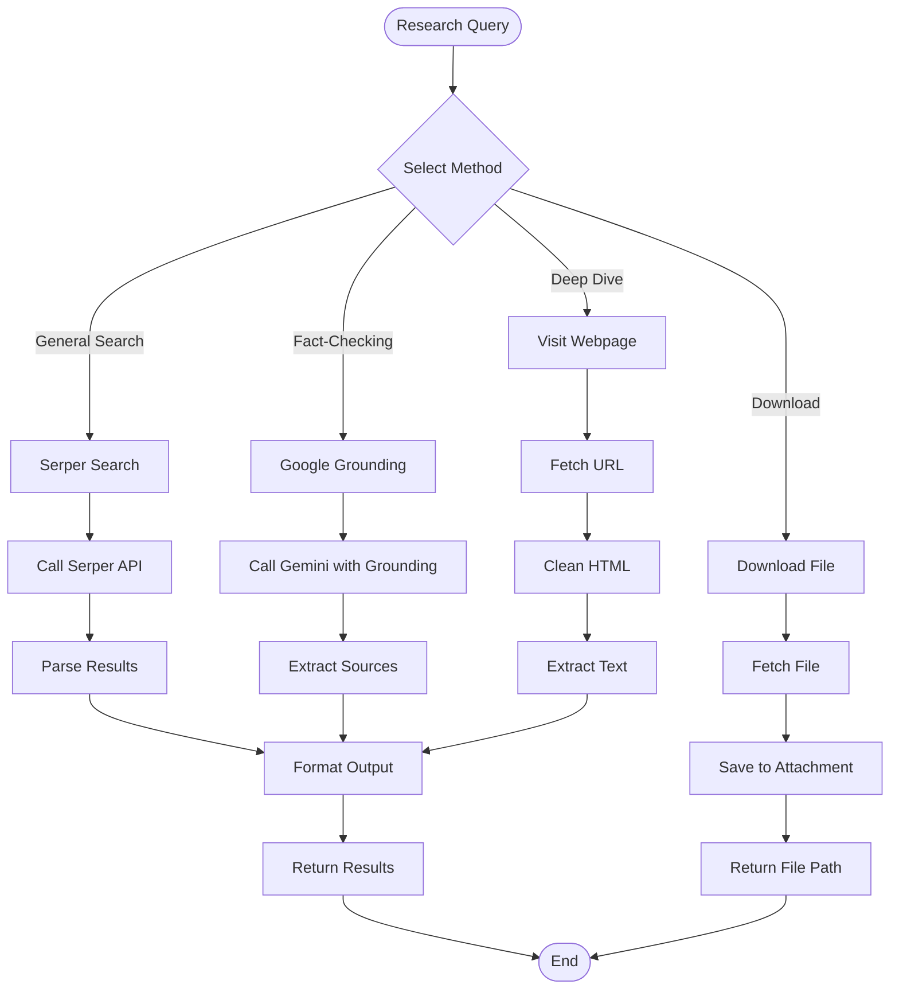

# Research Agent Documentation

## Overview

The **Research Agent** provides comprehensive web research capabilities using multiple search engines. It supports both Serper API for general search and Google Grounding for real-time, fact-checked information.

---

## Architecture

```
┌─────────────────────────────────────────────────────────────────┐
│                    Research Plugin Agent                        │
├─────────────────────────────────────────────────────────────────┤
│                                                                 │
│  ┌─────────────────────────────────────────────────────────┐   │
│  │                  Research Capabilities                  │   │
│  │                                                         │   │
│  │   ┌──────────────┐    ┌──────────────┐                 │   │
│  │   │ Serper Search│    │   Google     │                 │   │
│  │   │   (Serper)   │    │  Grounding   │                 │   │
│  │   └──────┬───────┘    └──────┬───────┘                 │   │
│  │          │                   │                         │   │
│  │          ▼                   ▼                         │   │
│  │   ┌─────────────────────────────────┐                 │   │
│  │   │        Search Results           │                 │   │
│  │   │  - Titles, URLs, Snippets       │                 │   │
│  │   │  - Rich results                 │                 │   │
│  │   │  - Citations                    │                 │   │
│  │   └─────────────┬───────────────────┘                 │   │
│  │                 │                                      │   │
│  │                 ▼                                      │   │
│  │   ┌─────────────────────────────────┐                 │   │
│  │   │     Webpage Extraction          │                 │   │
│  │   │  - Full text extraction         │                 │   │
│  │   │  - Content cleaning             │                 │   │
│  │   └─────────────┬───────────────────┘                 │   │
│  │                 │                                      │   │
│  │                 ▼                                      │   │
│  │   ┌─────────────────────────────────┐                 │   │
│  │   │      File Download              │                 │   │
│  │   │  - Save attachments             │                 │   │
│  │   │  - To attachment folder         │                 │   │
│  │   └─────────────────────────────────┘                 │   │
│  │                                                         │   │
│  └─────────────────────────────────────────────────────────┘   │
│                                                                 │
└─────────────────────────────────────────────────────────────────┘
```

---

## Flowchart



---

## Agent Structure

```python
class ResearchPluginAgent(BaseAgent):
    """
    Research Agent for web search and information gathering
    """
    
    # Configuration
    name = "research"
    description = "Conducts web research and gathers information from across the internet"
    keywords = ["search", "cari", "research", "find info", "web search", "google"]
    
    async def get_status(self, session_id) -> str
        # Stateless - always returns "none"
    
    async def handle(self, message: str, context: AgentContext) -> AgentResponse
        # Performs broad web search based on message
```

---

## Tools

### 1. `search_web` (Serper Search)
```python
@tool
async def search_web(query: str) -> str:
    """
    Search the web using Serper API (Google Search).
    
    Args:
        query: Search query string
    
    Returns:
        Formatted search results with titles, URLs, and snippets
    """
    # Uses Serper API
    # Returns: "**Search Results for: 'query'**\n\n1. **[Title](URL)**\n   Snippet\n\n2. ..."
```

**Features:**
- Google Search results
- Rich snippets
- News results
- Knowledge graph
- Up to 20 results

### 2. `search_google_grounding` (Google Grounding)
```python
@tool
async def search_google_grounding(query: str) -> str:
    """
    Search using Google Grounding with real-time web search.
    
    Args:
        query: Search query for fact-checking
    
    Returns:
        Factual information with citations from authoritative sources
    """
    # Uses Gemini with Google Search grounding
    # Returns: Detailed answer with sources
```

**Features:**
- Real-time web search
- Factual verification
- Citation extraction
- Authoritative sources
- Confidence scoring

### 3. `visit_webpage_tool`
```python
@tool
async def visit_webpage_tool(url: str) -> str:
    """
    Visit a webpage and extract its text content.
    
    Args:
        url: Webpage URL to visit
    
    Returns:
        Clean text content (up to 15,000 chars)
    """
    # Fetches URL with user-agent rotation
    # Cleans HTML (removes scripts, styles, nav, footer)
    # Returns extracted text
```

**Features:**
- User-agent rotation
- HTML cleaning
- JavaScript/style removal
- Content extraction
- 15K character limit

### 4. `download_file_tool`
```python
@tool
async def download_file_tool(url: str, filename: str = "") -> str:
    """
    Download a file from URL to attachment folder.
    
    Args:
        url: File URL to download
        filename: Optional custom filename
    
    Returns:
        Path to downloaded file
    """
    # Downloads file with timeout
    # Saves to attachment/ folder
    # Auto-generates filename if not provided
```

**Features:**
- Large file support (60s timeout)
- Automatic filename detection
- Saves to attachment folder
- Error handling

---

## Search Methods Comparison

| Feature | Serper Search | Google Grounding |
|---------|--------------|------------------|
| **Speed** | Fast | Moderate |
| **Real-time** | Yes | Yes |
| **Citations** | Basic | Rich |
| **Fact-checking** | Limited | Excellent |
| **Sources** | Multiple | Verified |
| **Best for** | General research | Fact verification |
| **Cost** | API credits | Gemini API |
| **Use case** | Broad search | Specific claims |

---

## Usage Examples

### Example 1: General Research
```python
from server.agents import create_default_registry, AgentContext

registry = create_default_registry()
agent = registry.get("research")

# Simple search
context = AgentContext(
    user_id="user_123",
    session_id="research_001"
)

response = await agent.handle(
    "Search for latest AI developments in Indonesia 2024",
    context
)

# Returns formatted search results
print(response.message)
```

### Example 2: Fact-Checking
```python
# Using Google Grounding for fact verification
from server.agents.research.tools import search_google_grounding

result = await search_google_grounding(
    "Is it true that Indonesia GDP grew 5% in 2024?"
)
# Returns: Detailed answer with citations
```

### Example 3: Deep Webpage Analysis
```python
# Visit specific webpage
from server.agents.research.tools import visit_webpage_tool

content = await visit_webpage_tool(
    "https://example.com/article"
)
# Returns: Clean extracted text
```

### Example 4: File Download
```python
# Download file
from server.agents.research.tools import download_file_tool

path = await download_file_tool(
    url="https://example.com/report.pdf",
    filename="annual_report.pdf"
)
# Returns: Path to downloaded file
```

---

## Configuration

### Environment Variables
```bash
# Required for Serper Search
SERPER_API_KEY=your_serper_api_key

# Required for Google Grounding
GOOGLE_API_KEY=your_google_api_key
```

### API Settings
```python
# Serper Configuration
SERPER_CONFIG = {
    'url': 'https://google.serper.dev/search',
    'timeout': 30,
    'max_results': 20
}

# Grounding Configuration
GROUNDING_CONFIG = {
    'model': 'gemini-2.0-flash',
    'timeout': 30
}

# Webpage Extraction
WEBPAGE_CONFIG = {
    'timeout': 30,
    'max_length': 15000,
    'follow_redirects': True
}
```

---

## Response Formats

### Serper Search Response
```
**Search Results for: 'AI in Indonesia 2024'**

1. **[Indonesia's AI Strategy 2024](https://example.com/ai-strategy)**
   Indonesia launches national AI strategy focusing on...

2. **[Top AI Startups in Indonesia](https://example.com/startups)**
   Leading AI companies include...

3. **[Government AI Initiatives](https://example.com/gov)**
   New regulations for AI development...
```

### Google Grounding Response
```
**Grounding Search Results for: 'Indonesia GDP growth 2024'**

Indonesia's GDP grew by approximately 5.05% in 2024, according to official government statistics. This growth was driven by strong domestic consumption and investment.

**Sources:**
- [Bank Indonesia Official Report](https://bi.go.id/)
- [BPS Statistics Indonesia](https://bps.go.id/)
```

### Webpage Extraction Response
```
Article Title

Full article text content...
Cleaned and extracted from HTML...
Up to 15,000 characters...
```

---

## Search Strategies

### Strategy 1: Broad Research
```python
# Use Serper for initial broad search
queries = [
    "topic overview",
    "topic latest news",
    "topic key players"
]
for query in queries:
    results = await search_web(query)
```

### Strategy 2: Fact Verification
```python
# Use Grounding for specific claims
claims = [
    "Company X revenue 2024",
    "Person Y achievement"
]
for claim in claims:
    result = await search_google_grounding(claim)
```

### Strategy 3: Deep Analysis
```python
# Combine search + webpage visit
search_results = await search_web("topic")
# Extract URLs from results
for url in extract_urls(search_results):
    content = await visit_webpage_tool(url)
    # Analyze content
```

---

## Error Handling

| Error | Cause | Response |
|-------|-------|----------|
| API key missing | SERPER_API_KEY not set | "Error: SERPER_API_KEY not configured" |
| API error | Serper API failure | "Search error: [details]" |
| No results | Query too specific | "No results found" |
| Timeout | Slow response | "Request timed out" |
| URL error | Invalid URL | "Error visiting page: [details]" |
| Download failed | File too large | "Error downloading file" |

---

## Rate Limiting

```python
# Built-in limits
MAX_SEARCH_QUERIES = 3  # Per research cycle
MAX_WEBPAGE_LENGTH = 15000  # Characters
DOWNLOAD_TIMEOUT = 60  # Seconds
SEARCH_TIMEOUT = 30  # Seconds
```

---

## Integration Points

- **Email Analyst Agent**: Uses for fact-checking claims
- **Dossier Agent**: Uses for biographical research
- **Strategy Agent**: Uses for competitive analysis
- **Composio**: Can use connected accounts for restricted content

---

## Testing

```bash
# Test research capabilities
uv run python -c "
from server.agents.research import ResearchPluginAgent
from server.agents.research.tools import get_research_tools

agent = ResearchPluginAgent()
tools = get_research_tools()

print(f'Agent: {agent.name}')
print(f'Tools: {len(tools)}')
for tool in tools:
    print(f'  - {tool.name}')
"
```

---

## Files Structure

```
gmail-agent/server/agents/research/
├── __init__.py          # Exports ResearchPluginAgent
├── agent.py             # Main agent class
├── logic.py             # Search implementations
└── tools.py             # 4 LangChain tools
```

---

## Summary

The Research Agent provides comprehensive web research:

- ✅ **Dual search methods** (Serper + Google Grounding)
- ✅ **Real-time information** with citations
- ✅ **Webpage extraction** for deep analysis
- ✅ **File downloading** for attachments
- ✅ **Fact-checking** with authoritative sources
- ✅ **Parallel execution** for multiple queries
- ✅ **Error handling** with graceful fallbacks

**Use Case**: Perfect for research tasks, fact verification, competitive analysis, gathering background information, and downloading resources.
