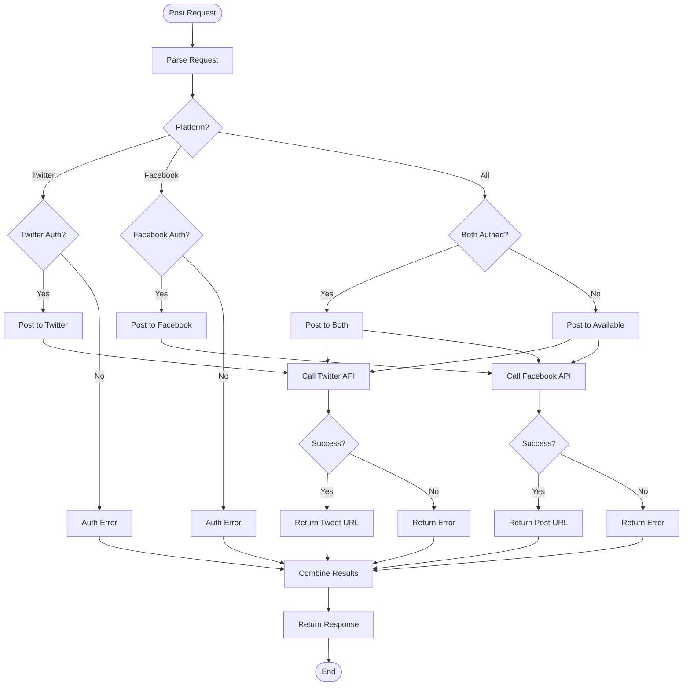

# Social Media Agent Documentation

## Overview

The **Social Media Agent** manages posting to Twitter/X and Facebook. It provides a unified interface for social media management with support for text posts and optional image attachments.

---

## Architecture

```
┌─────────────────────────────────────────────────────────────────┐
│                  Social Media Plugin Agent                      │
├─────────────────────────────────────────────────────────────────┤
│                                                                 │
│  ┌─────────────────────────────────────────────────────────┐   │
│  │              Social Media Management                    │   │
│  │                                                         │   │
│  │   Input: Post Request                                   │   │
│  │        │                                                │   │
│  │        ▼                                                │   │
│  │   ┌─────────────┐                                       │   │
│  │   │   Detect    │───▶ Twitter or Facebook?             │   │
│  │   │  Platform   │                                       │   │
│  │   └──────┬──────┘                                       │   │
│  │          │                                              │   │
│  │          ▼                                              │   │
│  │   ┌─────────────┐     ┌─────────────┐                  │   │
│  │   │   Post to   │     │   Post to   │                  │   │
│  │   │   Twitter   │     │   Facebook  │                  │   │
│  │   │             │     │             │                  │   │
│  │   │  - Text     │     │  - Text     │                  │   │
│  │   │  - Image    │     │  - Image    │                  │   │
│  │   │  - API      │     │  - API      │                  │   │
│  │   └──────┬──────┘     └──────┬──────┘                  │   │
│  │          │                   │                          │   │
│  │          └─────────┬─────────┘                          │   │
│  │                    │                                     │   │
│  │                    ▼                                     │   │
│  │   ┌─────────────────────────────────┐                   │   │
│  │   │      Post to All Platforms      │                   │   │
│  │   │         (Batch Mode)            │                   │   │
│  │   └─────────────────────────────────┘                   │   │
│  │                                                         │   │
│  └─────────────────────────────────────────────────────────┘   │
│                                                                 │
└─────────────────────────────────────────────────────────────────┘
```

---

## Flowchart



---

## Agent Structure

```python
class SocialMediaPluginAgent(BaseAgent):
    """
    Social Media Agent for Twitter and Facebook posting
    """
    
    # Configuration
    name = "social_media"
    description = "Posts content and manages Twitter/X and Facebook accounts"
    keywords = [
        "post", "share", "twitter", "tweet", "facebook",
        "sosmed", "social media", "unggah"
    ]
    
    async def get_status(self, session_id) -> str
        # Stateless - always returns "none"
    
    async def handle(self, message: str, context: AgentContext) -> AgentResponse
        # Detects platform from message and posts
```

---

## Platform Detection

The agent automatically detects the target platform from user input:

| Keywords | Platform |
|----------|----------|
| "twitter", "tweet" | Twitter/X |
| "facebook", "fb" | Facebook |
| Default (no platform specified) | Twitter/X |

---

## Tools

### 1. `post_to_twitter`
```python
@tool
async def post_to_twitter(
    text: str,
    image_path: str = ""
) -> str:
    """
    Post to Twitter/X with optional image.
    
    Args:
        text: Tweet text (max 280 chars)
        image_path: Optional path to image file
    
    Returns:
        Success message with tweet URL or error
    """
```

**Features:**
- Text tweets
- Image attachments
- Character limit validation
- URL in response

### 2. `post_to_facebook`
```python
@tool
async def post_to_facebook(
    text: str,
    image_path: str = ""
) -> str:
    """
    Post to Facebook with optional image.
    
    Args:
        text: Post text
        image_path: Optional path to image file
    
    Returns:
        Success message with post URL or error
    """
```

**Features:**
- Text posts
- Image attachments
- Longer text support
- URL in response

### 3. `post_to_all_social_media`
```python
@tool
async def post_to_all_social_media(
    text: str,
    image_path: str = ""
) -> str:
    """
    Post to both Twitter and Facebook simultaneously.
    
    Args:
        text: Post text
        image_path: Optional path to image file
    
    Returns:
        Combined results from both platforms
    """
```

**Features:**
- Cross-platform posting
- Unified response
- Error handling per platform

---

## Authentication Flow

```
┌──────────────┐
│  User Wants  │
│    to Post   │
└──────┬───────┘
       │
       ▼
┌──────────────────┐
│ Check Connection │
│    for Platform  │
└──────┬───────────┘
       │
       ▼
┌──────────────┐
│  Connected?  │
└──────┬───────┘
       │
   ┌───┴───┐
   │       │
   ▼       ▼
┌─────┐ ┌──────────────────┐
│ Yes │ │ Return Auth Link │
└──┬──┘ └──────────────────┘
   │
   ▼
┌──────────────────┐
│  Execute Post    │
└──────────────────┘
```

---

## Usage Examples

### Example 1: Simple Tweet
```python
from server.agents import create_default_registry, AgentContext

registry = create_default_registry()
agent = registry.get("social_media")

# Post to Twitter (auto-detected)
context = AgentContext(
    user_id="user_123",
    session_id="social_001"
)

response = await agent.handle(
    "Post to Twitter: Excited to announce our new product launch!",
    context
)

# Response: "✅ Posted to Twitter: https://twitter.com/..."
```

### Example 2: Facebook Post
```python
# Post to Facebook (explicitly specified)
response = await agent.handle(
    "Share on Facebook: Check out our latest blog post about AI",
    context
)

# Response: "✅ Posted to Facebook: https://facebook.com/..."
```

### Example 3: Post to Both Platforms
```python
# Post to both platforms
from server.agents.social_media.tools import post_to_all_social_media

result = await post_to_all_social_media(
    text="Big news! We're expanding to new markets! 🚀",
    image_path="/path/to/announcement.png"
)

# Response includes both Twitter and Facebook results
```

### Example 4: With Image
```python
# Post with image
response = await agent.handle(
    "Tweet this with the attached image: Our team at the conference",
    context
)

# If context.metadata contains image_path, it will be included
```

---

## Configuration

### Environment Variables
```bash
# Required for Composio integration
COMPOSIO_API_KEY=your_composio_api_key

# No direct API keys needed
# Composio handles OAuth for Twitter/Facebook
```

### Composio Setup
```python
# Twitter/X
- App: Twitter
- Permissions: Read + Write
- OAuth flow required

# Facebook
- App: Facebook
- Permissions: publish_posts
- OAuth flow required
```

### Post Limits
```python
LIMITS = {
    'twitter': {
        'text': 280,  # characters
        'images': 4   # per tweet
    },
    'facebook': {
        'text': 63206,  # characters
        'images': 10    # per post
    }
}
```

---

## Response Formats

### Success Response (Twitter)
```
✅ Successfully posted to Twitter!

Tweet: "Excited to announce our new product launch! 🚀"
URL: https://twitter.com/username/status/1234567890
Posted at: 2024-01-15 14:30:00 UTC
```

### Success Response (Facebook)
```
✅ Successfully posted to Facebook!

Post: "Check out our latest blog post about AI"
URL: https://facebook.com/username/posts/1234567890
Posted at: 2024-01-15 14:30:00 UTC
```

### Error Response
```
❌ Failed to post to Twitter

Error: Authentication required
Please connect your Twitter account first.
Connection URL: https://composio.io/connect/twitter
```

---

## Authentication Check

```python
from server.auth import (
    check_twitter_connected,
    check_facebook_connected
)

# Check if accounts are connected
twitter_connected = check_twitter_connected(composio_client, user_id)
facebook_connected = check_facebook_connected(composio_client, user_id)

if not twitter_connected:
    # Prompt user to connect
    connect_url = connect_twitter(composio_client, user_id)
```

---

## Error Handling

| Error | Cause | Solution |
|-------|-------|----------|
| Not authenticated | Account not connected | Provide auth link |
| Character limit | Text too long | Truncate or split |
| Image too large | File size > 5MB | Compress image |
| API error | Platform API failure | Retry or notify |
| Rate limited | Too many posts | Wait and retry |

---

## Integration Points

- **Composio**: OAuth and API management
- **Auth Module**: Connection status checking
- **Quote Agent**: Can generate images for posts
- **Strategy Agent**: Can create social media strategies

---

## Testing

```bash
# Test social media agent
uv run python -c "
from server.agents.social_media import SocialMediaPluginAgent
from server.agents.social_media.tools import get_social_media_tools

agent = SocialMediaPluginAgent()
tools = get_social_media_tools()

print(f'Agent: {agent.name}')
print(f'Platforms: Twitter, Facebook')
print(f'Tools: {len(tools)}')
for tool in tools:
    print(f'  - {tool.name}')
"
```

---

## Files Structure

```
gmail-agent/server/agents/social_media/
├── __init__.py          # Exports SocialMediaPluginAgent
├── agent.py             # Main agent class
├── logic.py             # Posting logic for Twitter/Facebook
└── tools.py             # 3 LangChain tools
```

---

## Summary

The Social Media Agent provides unified social media management:

- ✅ **Multi-platform** (Twitter/X + Facebook)
- ✅ **Auto-detection** of platform from input
- ✅ **Image support** for rich posts
- ✅ **Batch posting** to all platforms
- ✅ **OAuth integration** via Composio
- ✅ **Character limits** enforced
- ✅ **URL tracking** for all posts

**Use Case**: Perfect for managing social media presence, sharing updates, announcements, and content across Twitter and Facebook from a single interface.
