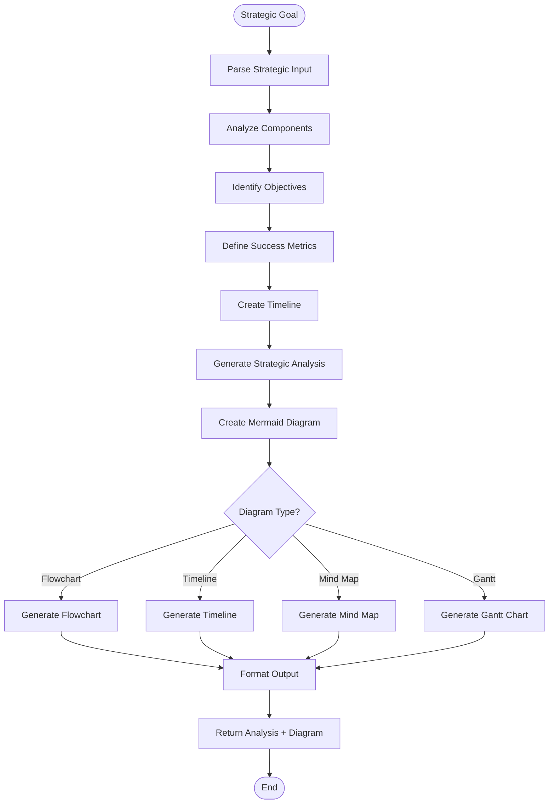
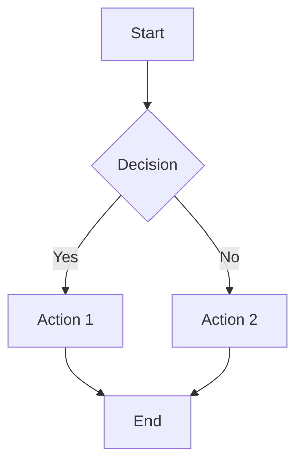
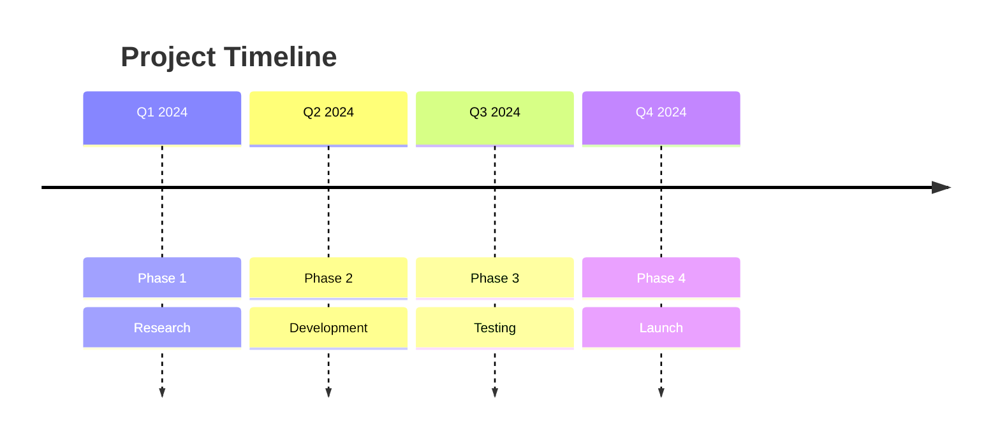
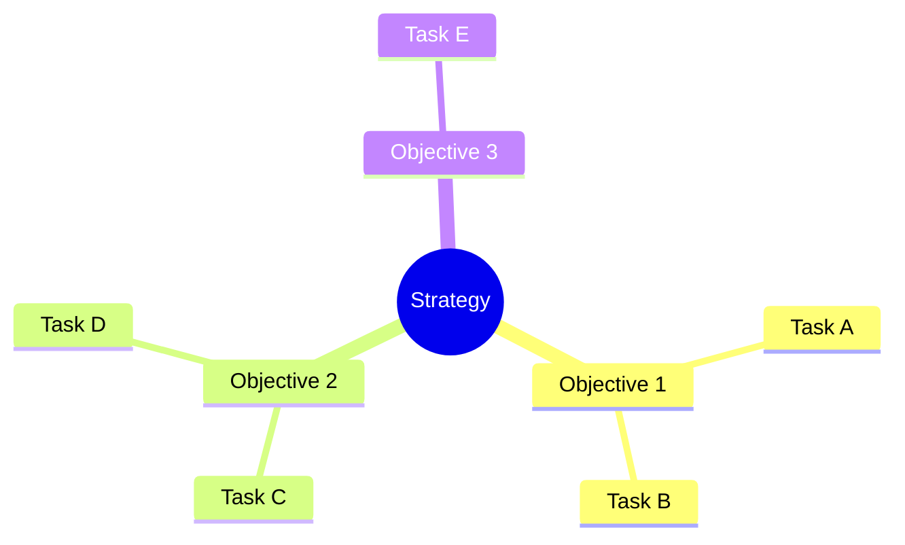
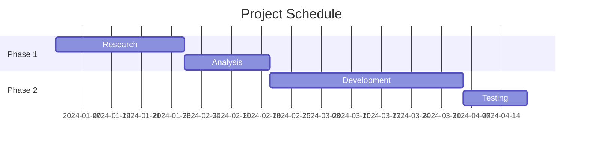
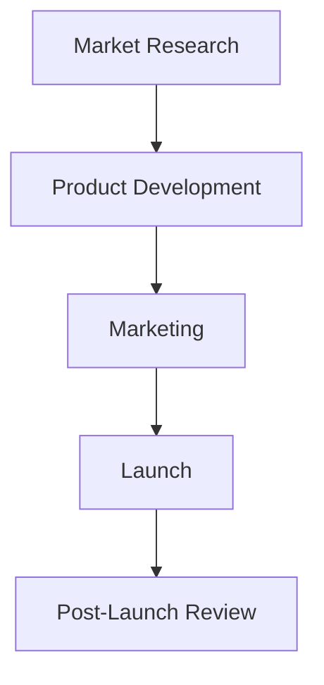

# Strategy Agent Documentation

## Overview

The **Strategy Agent** analyzes strategic goals and generates visual diagrams to visualize plans. It uses AI to break down complex objectives into actionable steps and creates Mermaid diagrams for clear visualization.

---

## Architecture

```
┌─────────────────────────────────────────────────────────────────┐
│                    Strategy Plugin Agent                        │
├─────────────────────────────────────────────────────────────────┤
│                                                                 │
│  ┌─────────────────────────────────────────────────────────┐   │
│  │               Strategy Analysis Pipeline                │   │
│  │                                                         │   │
│  │   Input: Strategic Goal                                 │   │
│  │        │                                                │   │
│  │        ▼                                                │   │
│  │   ┌─────────────┐                                       │   │
│  │   │   Analyze   │───▶ Break down objectives            │   │
│  │   │    Goal     │───▶ Identify key components          │   │
│  │   │             │───▶ Define success metrics           │   │
│  │   └──────┬──────┘                                       │   │
│  │          │                                              │   │
│  │          ▼                                              │   │
│  │   ┌─────────────┐                                       │   │
│  │   │    Create   │───▶ Generate timeline               │   │
│  │   │    Plan     │───▶ Define milestones               │   │
│  │   │             │───▶ Allocate resources              │   │
│  │   └──────┬──────┘                                       │   │
│  │          │                                              │   │
│  │          ▼                                              │   │
│  │   ┌─────────────┐                                       │   │
│  │   │  Generate   │───▶ Create Mermaid diagram          │   │
│  │   │   Diagram   │───▶ Visual workflow                 │   │
│  │   │             │───▶ Flowchart generation            │   │
│  │   └──────┬──────┘                                       │   │
│  │          │                                              │   │
│  │          ▼                                              │   │
│  │   ┌─────────────┐                                       │   │
│  │   │   Return    │───▶ Analysis + Diagram              │   │
│  │   │   Results   │                                       │   │
│  │   └─────────────┘                                       │   │
│  │                                                         │   │
│  └─────────────────────────────────────────────────────────┘   │
│                                                                 │
└─────────────────────────────────────────────────────────────────┘
```

---

## Flowchart



---

## Agent Structure

```python
class StrategyPluginAgent(BaseAgent):
    """
    Strategy Agent for analyzing goals and creating diagrams
    """
    
    # Configuration
    name = "strategy"
    description = "Analyzes strategic goals and generates Mermaid diagrams to visualize plans"
    keywords = [
        "strategy", "strategi", "diagram",
        "plan", "roadmap", "mermaid", "visualisasi"
    ]
    
    async def get_status(self, session_id) -> str
        # Stateless - always returns "none"
    
    async def handle(self, message: str, context: AgentContext) -> AgentResponse
        # Analyzes strategy and generates diagram
```

---

## Components

### 1. Strategic Analyzer
```python
async def analyze_strategic_prompt_logic(
    strategic_goal: str
) -> str:
    """
    Analyze strategic goal and return:
    - Objective breakdown
    - Key components
    - Success metrics
    - Action items
    - Timeline recommendations
    """
```

### 2. Diagram Generator
```python
async def generate_strategy_diagram(
    analysis: str,
    diagram_type: str = "flowchart"
) -> str:
    """
    Generate Mermaid diagram from analysis.
    
    Diagram types:
    - flowchart: Process flow
    - timeline: Sequential steps
    - mindmap: Concept mapping
    - gantt: Project timeline
    """
```

---

## Tools

### 1. `analyze_strategy`
```python
@tool
async def analyze_strategy(
    strategic_goal: str
) -> str:
    """
    Analyze a strategic goal and provide actionable insights.
    
    Args:
        strategic_goal: The strategic objective to analyze
    
    Returns:
        Detailed analysis with objectives, metrics, and recommendations
    """
```

**Features:**
- Goal decomposition
- Component identification
- Success metrics
- Timeline suggestions
- Resource allocation

### 2. `generate_strategy_diagram`
```python
@tool
async def generate_strategy_diagram(
    analysis_text: str,
    diagram_type: str = "flowchart"
) -> str:
    """
    Generate a Mermaid diagram from strategic analysis.
    
    Args:
        analysis_text: The strategic analysis text
        diagram_type: Type of diagram (flowchart, timeline, mindmap, gantt)
    
    Returns:
        Mermaid diagram code
    """
```

**Features:**
- Mermaid syntax generation
- Multiple diagram types
- Visual workflow
- Timeline visualization

---

## Mermaid Diagram Types

### 1. Flowchart


**Use for**: Process flows, decision trees, workflows

### 2. Timeline


**Use for**: Sequential phases, milestones, quarters

### 3. Mind Map


**Use for**: Brainstorming, concept mapping, idea organization

### 4. Gantt Chart


**Use for**: Project planning, scheduling, dependencies

---

## Usage Examples

### Example 1: Business Strategy
```python
from server.agents import create_default_registry, AgentContext

registry = create_default_registry()
agent = registry.get("strategy")

# Analyze business strategy
context = AgentContext(
    user_id="user_123",
    session_id="strategy_001"
)

response = await agent.handle(
    "Analyze strategy for launching new product in Q2",
    context
)

# Returns: Analysis + Mermaid diagram
```

### Example 2: Marketing Strategy
```python
from server.agents.strategy.tools import analyze_strategy

# Analyze marketing strategy
result = await analyze_strategy(
    strategic_goal="""
    Digital marketing strategy for e-commerce startup:
    - Target audience: Young professionals
    - Budget: $50K
    - Timeline: 6 months
    - Goal: 10K new customers
    """
)

# Returns detailed analysis with recommendations
```

### Example 3: Generate Diagram
```python
from server.agents.strategy.tools import generate_strategy_diagram

# Generate flowchart
analysis = """
Objective: Launch new mobile app
Phases:
1. Research and Planning
2. Development
3. Testing
4. Marketing
5. Launch
"""

diagram = await generate_strategy_diagram(
    analysis_text=analysis,
    diagram_type="flowchart"
)

# Returns Mermaid code
```

### Example 4: Complete Workflow
```python
# Full analysis + diagram
context = AgentContext(
    user_id="user_123",
    session_id="strategy_002",
    metadata={
        "goal": "Expand to international markets",
        "budget": "$1M",
        "timeline": "12 months"
    }
)

response = await agent.handle(
    "Create strategic plan for international expansion",
    context
)
```

---

## Configuration

### Environment Variables
```bash
# Required for analysis
GOOGLE_API_KEY=your_google_api_key

# Optional
OPENAI_API_KEY=your_openai_api_key  # Alternative LLM
```

### LLM Configuration
```python
LLM_CONFIG = {
    'model': 'gemini-2.0-flash',
    'temperature': 0.3,  # Lower for structured output
    'max_tokens': 2000
}
```

### Diagram Settings
```python
DIAGRAM_CONFIG = {
    'default_type': 'flowchart',
    'supported_types': ['flowchart', 'timeline', 'mindmap', 'gantt'],
    'theme': 'default',
    'orientation': 'TD'  # Top-Down
}
```

---

## Analysis Output Format

```markdown
# Strategic Analysis: [Goal]

## Executive Summary
Brief overview of the strategic objective and approach.

## Objective Breakdown
### Primary Objective
[Main goal]

### Secondary Objectives
1. [Sub-goal 1]
2. [Sub-goal 2]
3. [Sub-goal 3]

## Key Components
- Component A: [Description]
- Component B: [Description]
- Component C: [Description]

## Success Metrics
- Metric 1: [KPI] - Target: [Value]
- Metric 2: [KPI] - Target: [Value]

## Timeline
### Phase 1: [Name] (Duration)
- Task 1
- Task 2

### Phase 2: [Name] (Duration)
- Task 3
- Task 4

## Resource Allocation
- Budget: [Amount]
- Team: [Roles]
- Tools: [Resources]

## Risk Factors
- Risk 1: [Description] - Mitigation: [Strategy]
- Risk 2: [Description] - Mitigation: [Strategy]

## Recommendations
1. [Recommendation 1]
2. [Recommendation 2]
3. [Recommendation 3]

## Mermaid Diagram
```mermaid
[Generated diagram code]
```
```

---

## Response Formats

### Analysis Success
```
📊 Strategic Analysis Complete

Goal: Launch new product in Q2

Key Findings:
✓ Market opportunity identified
✓ 5-phase approach recommended
✓ Budget: $50K allocated
✓ Timeline: 6 months

Components:
• Market Research (Month 1-2)
• Product Development (Month 2-4)
• Marketing Campaign (Month 4-6)
• Launch Event (Month 6)

Success Metrics:
• 10,000 new customers
• $500K revenue
• 15% market share
```

### Diagram Success
```
📈 Strategy Diagram Generated

Type: Flowchart
Format: Mermaid



Copy this code to Mermaid Live Editor or GitHub
```

### Error Response
```
⚠️  Strategy analysis failed

Error: Unable to parse strategic goal
Please provide a clear strategic objective.

Examples:
- "Launch new product line in Q2"
- "Expand to European markets"
- "Increase market share by 20%"
```

---

## Integration Points

- **LLM (Gemini/Groq)**: Strategic analysis generation
- **Mermaid**: Diagram syntax generation
- **PDF Agent**: Can include diagrams in reports
- **Email Analyst**: Can analyze strategic emails
- **Research Agent**: Can gather market data

---

## Use Cases

### 1. Business Planning
- Market entry strategies
- Product launches
- Expansion plans
- Investment decisions

### 2. Project Management
- Project roadmaps
- Milestone planning
- Resource allocation
- Timeline visualization

### 3. Marketing Strategy
- Campaign planning
- Channel strategy
- Budget allocation
- KPI tracking

### 4. Operations
- Process optimization
- Workflow design
- Organizational structure
- Change management

---

## Testing

```bash
# Test strategy agent
uv run python -c "
from server.agents.strategy import StrategyPluginAgent
from server.agents.strategy.tools import get_strategy_tools

agent = StrategyPluginAgent()
tools = get_strategy_tools()

print(f'Agent: {agent.name}')
print(f'Tools: {len(tools)}')
for tool in tools:
    print(f'  - {tool.name}')
"
```

---

## Files Structure

```
gmail-agent/server/agents/strategy/
├── __init__.py          # Exports StrategyPluginAgent
├── agent.py             # Main agent class
├── logic.py             # Analysis and diagram generation
└── tools.py             # 2 LangChain tools
```

---

## Summary

The Strategy Agent provides strategic analysis and visualization:

- ✅ **Goal analysis** with objective breakdown
- ✅ **Mermaid diagrams** for visualization
- ✅ **Multiple diagram types** (flowchart, timeline, mindmap, gantt)
- ✅ **Success metrics** and KPIs
- ✅ **Timeline recommendations**
- ✅ **Resource allocation** suggestions
- ✅ **Risk assessment**
- ✅ **Actionable recommendations**

**Use Case**: Perfect for business planning, project management, marketing strategy, and any scenario requiring strategic analysis with clear visual representation.
